<p align="center">
  
  
  
  
  
  
</p>

# ThinkWatch Lite

**[English](README.md) | [中文](README.zh-CN.md)**

ThinkWatch Lite is a desktop app for macOS, Windows and Linux that runs an AI
API gateway on the local machine. Claude Code, Codex and other clients of the
OpenAI and Anthropic APIs send their requests through it, and the app records
what each request cost, which upstream served it and which keys were redacted
before it was sent. The gateway can also be deployed on a server; the app then
connects to ThinkWatch Core on that server over an encrypted control channel.

<picture>
  <source media="(prefers-color-scheme: dark)" srcset="docs/screenshots/en/overview-dark.png">
  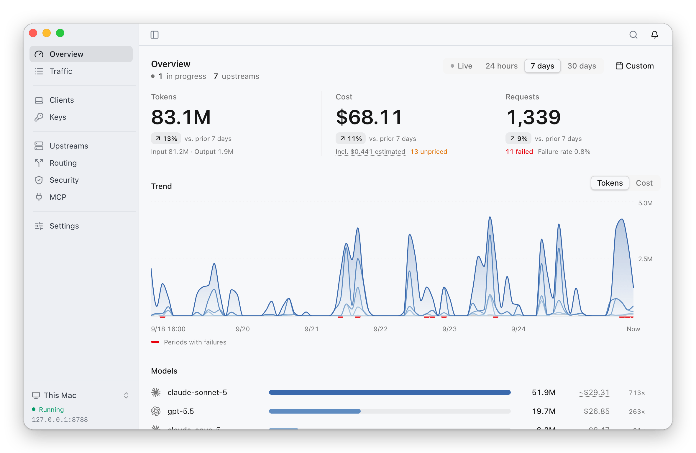
</picture>

The app runs in the menu bar on macOS and in the system tray on Windows and
Linux. It requires macOS 12 or later on Apple silicon, Windows 10 21H2 or later
on x64 or ARM64, or Linux on x86_64 or aarch64 (Ubuntu 22.04, Debian 12,
Fedora 36 or later). The interface is available in English and Simplified
Chinese; it follows the system language and can be changed in Settings. The
app updates itself on all three platforms, except that a Homebrew installation
is updated through Homebrew.

## Install

| Platform | Install |
|---|---|
| macOS, Apple silicon | `brew install --cask thinkwatchproject/tap/thinkwatch-lite`, or [`ThinkWatch-Lite-<version>-arm64.dmg`](https://github.com/ThinkWatchProject/ThinkWatch-Lite/releases/latest) |
| Windows, x64 | [`ThinkWatch-Lite-<version>-x64-setup.exe`](https://github.com/ThinkWatchProject/ThinkWatch-Lite/releases/latest) |
| Windows, ARM64 | [`ThinkWatch-Lite-<version>-arm64-setup.exe`](https://github.com/ThinkWatchProject/ThinkWatch-Lite/releases/latest) |
| Linux, x86_64 or aarch64 | `curl -fsSL https://github.com/ThinkWatchProject/ThinkWatch-Lite/releases/latest/download/install.sh \| sh`, or [`ThinkWatch-Lite-<version>-<arch>.AppImage`](https://github.com/ThinkWatchProject/ThinkWatch-Lite/releases/latest) |

The [Lite page](https://thinkwat.ch/lite#install) offers a one-click download
of the latest version and selects the Windows or Linux architecture
automatically. The gateway,
[ThinkWatch Core](https://github.com/ThinkWatchProject/ThinkWatch-Core), ships
inside the app; nothing else needs to be installed.

### macOS

```bash
brew install --cask thinkwatchproject/tap/thinkwatch-lite
```

A disk image is also available from the
[latest release](https://github.com/ThinkWatchProject/ThinkWatch-Lite/releases/latest):
download `ThinkWatch-Lite-<version>-arm64.dmg`, check it against the sha256
published beside it, and drag ThinkWatch Lite into Applications. The app is
**not signed by a registered Apple developer**, so macOS quarantines a
downloaded copy and refuses to open it until the attribute is removed:

```bash
xattr -dr com.apple.quarantine "/Applications/ThinkWatch Lite.app"
```

The same can be done without a terminal: after the first refused launch,
choose Open Anyway in System Settings › Privacy & Security. Removing that
attribute is the only thing
[the cask](https://github.com/ThinkWatchProject/homebrew-tap) does beyond
copying the app out of the disk image.

### Windows

Download the installer for the machine's architecture from the
[latest release](https://github.com/ThinkWatchProject/ThinkWatch-Lite/releases/latest):
`ThinkWatch-Lite-<version>-x64-setup.exe` for most PCs, or
`ThinkWatch-Lite-<version>-arm64-setup.exe` for a PC with an ARM processor.
Check it against the sha256 published beside it:

```powershell
Get-FileHash .\ThinkWatch-Lite-<version>-x64-setup.exe
```

The installer sets the app up for all users in Program Files, so Windows asks
for administrator permission. It requires Windows 10 21H2 or later; WebView2,
which Windows 11 already includes, is downloaded during installation if it is
missing.

The installer is **not code-signed**, and no certificate will be bought.
Running a downloaded copy brings up SmartScreen's full-screen warning,
"Windows protected your PC". Choose **More info**, then **Run anyway**.

Once installed, the app runs from the notification area. Data is kept in
`%APPDATA%\ThinkWatch`.

### Linux

```bash
curl -fsSL https://github.com/ThinkWatchProject/ThinkWatch-Lite/releases/latest/download/install.sh | sh
```

The script downloads the AppImage for the machine's architecture, checks it
against the sha256 published beside it, installs it as
`~/Applications/ThinkWatch-Lite.AppImage` and starts it. Running it again
installs the latest version over the old one.

To install by hand, download `ThinkWatch-Lite-<version>-x86_64.AppImage` or
`ThinkWatch-Lite-<version>-aarch64.AppImage` from the
[latest release](https://github.com/ThinkWatchProject/ThinkWatch-Lite/releases/latest),
check it with `sha256sum -c`, allow it to run (`chmod +x`, or Properties ›
"Allow executing file as program" in the file manager) and open it. Keep it in
a folder the user can write to, such as `~/Applications`, so that it can
update itself. The first launch adds ThinkWatch Lite to the application menu,
together with its icon and the `thinkwatch://` link handler. Only the AppImage
is published; there are no deb, rpm, Flatpak or Snap packages.

An AppImage mounts itself with FUSE and needs `fusermount3` from the fuse3
package (libfuse2 is not needed). Most desktops already include it; otherwise:

| Distribution | Command |
|---|---|
| Ubuntu, Debian | `sudo apt install fuse3` |
| Fedora | `sudo dnf install fuse3` |
| Arch Linux | `sudo pacman -S fuse3` |
| openSUSE | `sudo zypper install fuse3` |

The tray icon relies on AppIndicator. Ubuntu ships the GNOME extension for it;
Fedora's stock GNOME does not, and the AppIndicator extension has to be added.
Without a tray, closing the window leaves the gateway running, and launching
ThinkWatch Lite again from the application menu brings the window back. Data is
kept in `~/.thinkwatch`.

- **Blank window on NVIDIA under Wayland:** start the app with
  `WEBKIT_DISABLE_DMABUF_RENDERER=1`.
- **Other machines cannot reach the gateway:** firewalld, which Fedora enables
  by default, blocks the gateway port until it is opened; Settings shows a
  note about this when the gateway listens on the local network.
- **Uninstalling:** use Settings › Full uninstall first, which restores the clients
  the app configured and removes the autostart and application menu entries,
  then delete the AppImage.

## Features

The main window has nine pages: Overview, Traffic, Clients, Keys, Upstreams,
Routing, Security, MCP and Settings.

### Usage and cost

The Overview page reports tokens, cost and requests for the last 24 hours,
7 days, 30 days or a custom range, each against the period before; a live view
follows the last ten minutes. A trend chart stacks tokens or cost by model, and
the model ranking beneath it opens the matching requests. Further sections
cover the prompt cache (hit rate, the net savings it brought and the hit rate
per model), latency (median and 95th-percentile time to first byte, per model
and per upstream) and what each protection found.

The cost figure states how much of it is estimated, for instance for a
response that was cut off before it finished. Requests whose model has no
price, and requests whose upstream reported no usage, are counted separately
and never added in as zero. Prices come from price sheets: the default one
follows LiteLLM's public prices and is refreshed once a day, and a custom one
applies a multiplier and its own prices for particular models, as needed for a
relay whose prices differ from the official ones. A subscription account such
as a ChatGPT sign-in is priced from the price sheet like any other upstream,
and an upstream such as a local model can be set to free. Each request's cost
is fixed when the request finishes, and the request records the price sheet
and the date of the prices it was costed with.

### Traffic and sessions

The Traffic page lists requests as they arrive: status, key, model, upstream,
time to first byte and total time, tokens and cost, with marks for a converted
API format, redacted keys and a blocked or suspicious tool call. The list can
be filtered by key, upstream and model, or narrowed to failed or unpriced
requests. The Sessions view groups the requests of one conversation into
turns, with the input tokens and the cost of each turn.

A request opens into its timeline, its routing (the rule it matched, the group
it went through and each attempt with its status and duration), the request
and response bodies, and its usage and cost. A finished request can be sent
again, unchanged, to another upstream after an estimate of its cost, and the
two responses are shown side by side.

<picture>
  <source media="(prefers-color-scheme: dark)" srcset="docs/screenshots/en/traffic-dark.png">
  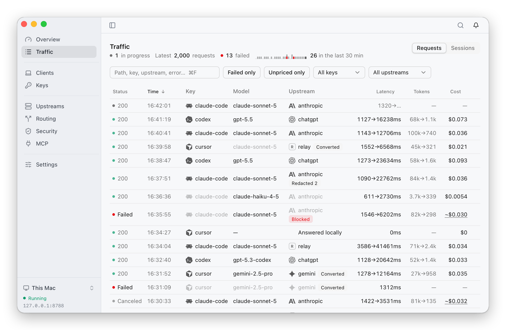
</picture>

### Client setup

The Clients page points Claude Code, Codex, opencode, Zed and Aider at the
gateway. Before anything is written, it lists the fields that change and what
else the change affects (the ChatGPT desktop app, for instance, reads the same
configuration file as Codex), shows the full diff and backs up the original
file. Only the settings that point the client at the gateway change, and each
client receives a key of its own. A connected client can be restored at any
time, on its own or together with all the others. Cursor, Continue and
Gemini CLI come with step-by-step instructions and a key created for them. For
every client the page shows whether it is in use, waiting for its first
request or not in effect, and its requests over the last 24 hours.

<picture>
  <source media="(prefers-color-scheme: dark)" srcset="docs/screenshots/en/clients-dark.png">
  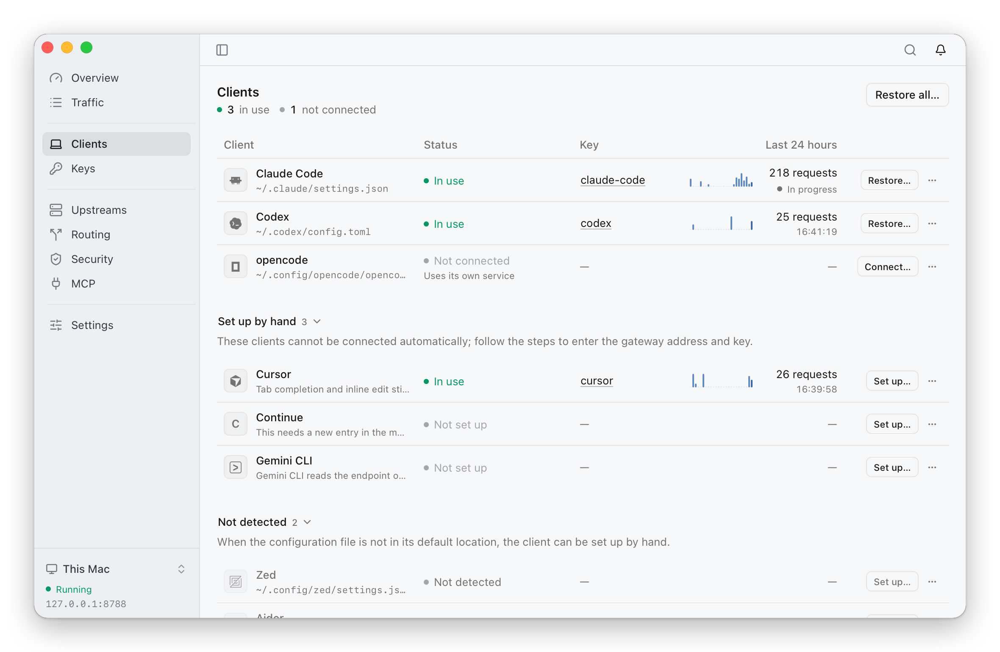
</picture>

### Keys

Clients reach the gateway with a key, on the local machine as well. The Keys
page lists the default key, used by clients that were not given one of their
own, and a key for each connected client, labelled with the client it belongs
to so that its requests can be told apart in Traffic. Each key has a route,
the models it may use (all, none, or chosen models and patterns such as
`gpt-5*`), an optional limit on concurrent requests, and its requests and cost
over the last 24 hours. A key can be disabled, which rejects every request
made with it, or rotated; rotating writes the new key into the configuration
of the client that uses it.

<picture>
  <source media="(prefers-color-scheme: dark)" srcset="docs/screenshots/en/keys-dark.png">
  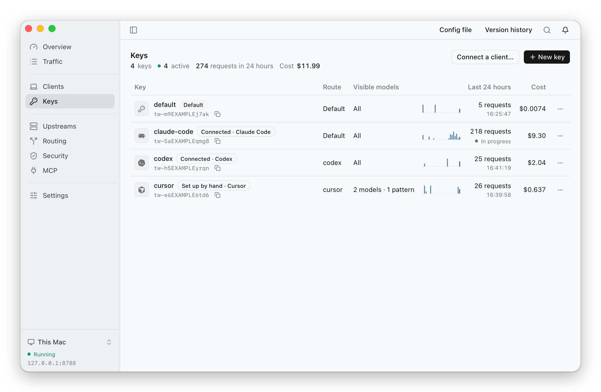
</picture>

### Upstreams

Upstreams are the services requests are forwarded to: API keys for Anthropic,
OpenAI, Google Gemini, DeepSeek or any compatible endpoint, a ChatGPT account
or a Z.ai / BigModel account signed in from the app, relays such as
OpenRouter, and local models such as Ollama. A ChatGPT account shows its usage
limits and reset times. When a client and an upstream use different API
formats, requests are converted between Anthropic Messages, OpenAI Chat
Completions, OpenAI Responses and Gemini, and the fields that cannot be
carried over are listed on the request. Upstreams can be reached through an
outbound proxy and priced with a price sheet of their own; proxies and price
sheets have tabs on the same page. A connection test times the DNS lookup and
the TCP, TLS and proxy handshakes without incurring any cost; an inference test
measures the time to first token and estimates its cost before it runs.

API keys and header values can be written as `${NAME}` to read a system
environment variable. On macOS these come from the login shell, so variables
exported in `~/.zshrc` and similar files apply, and the same holds on Linux
(`~/.bashrc`, `~/.profile` and so on); on Windows they are the
environment variables configured in system settings. After a variable changes,
reopening the app picks it up. Proxy variables such as `HTTPS_PROXY`, and
`PATH`, are not read.

<picture>
  <source media="(prefers-color-scheme: dark)" srcset="docs/screenshots/en/upstreams-dark.png">
  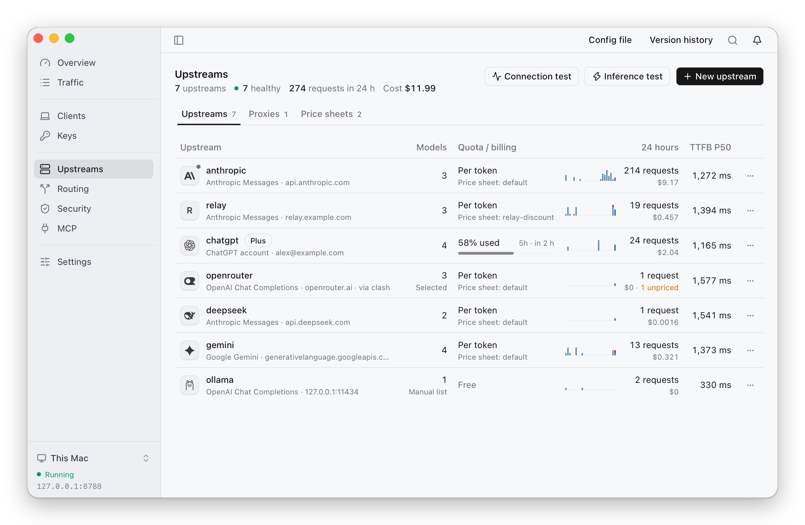
</picture>

### Routing and failover

Each key follows a route, and keys without one follow the default route. A
route is a list of rules evaluated in order. A rule matches on the model, the
key, the client's API format, input tokens, `max_tokens`, the number of tools,
images, extended thinking, streaming, prompt caching or the kind of auxiliary
request; it then forwards the request to an upstream or a group, or refuses
it, and can rewrite the model, `max_tokens` or extended thinking. A group puts
several upstreams behind one name and decides the order in which they are
tried: as listed, manually selected, in turn, lowest latency first or lowest
cost first. When an attempt fails, the request moves on to the next upstream,
and by default a session stays on one upstream so that its prompt cache keeps
hitting. A map at the top of the page traces every key through its route and
groups to the upstreams.

<picture>
  <source media="(prefers-color-scheme: dark)" srcset="docs/screenshots/en/routing-dark.png">
  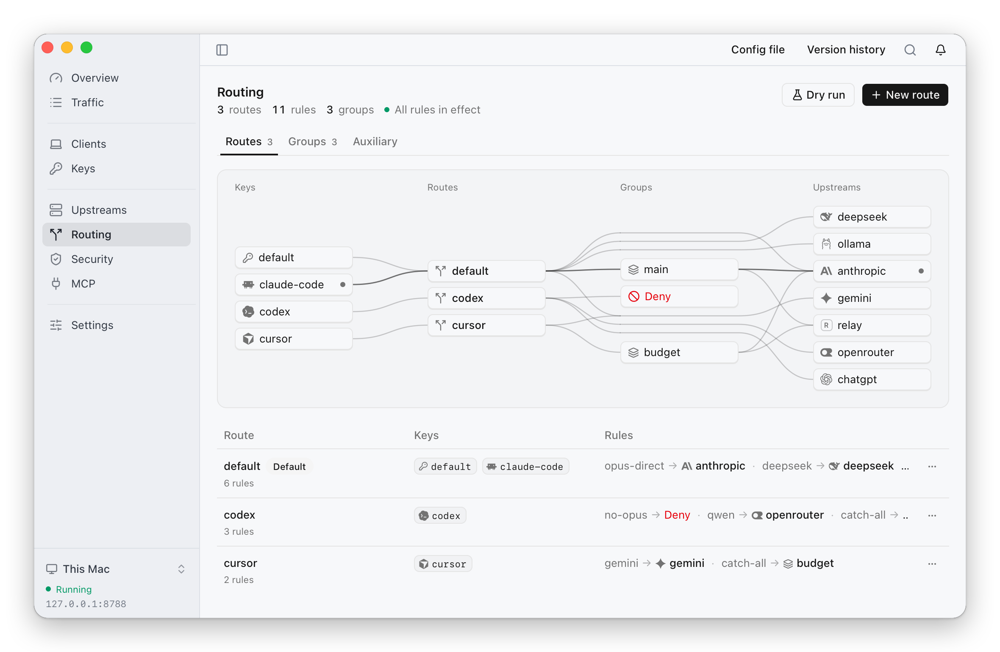
</picture>

Auxiliary requests that clients send on their own (health checks, warm-ups,
titles, topic detection and input suggestions) can be answered locally at no
cost, passed through, or routed by the rules.

Every request records the rule it matched, the group it went through and each
attempt with its status and duration. A dry run evaluates the rules for a
given request and shows where it would go and why, without sending anything
and without incurring any cost.

<picture>
  <source media="(prefers-color-scheme: dark)" srcset="docs/screenshots/en/dry-run-dark.png">
  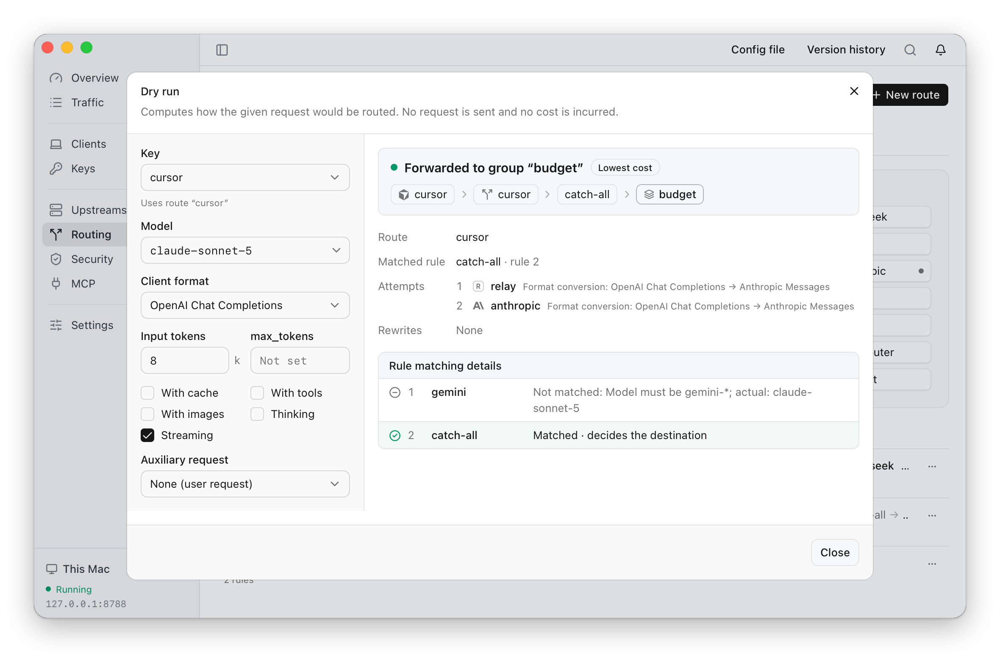
</picture>

### Security

The Security page holds five protections. They apply to every upstream and
every key alike, and each runs in one of three modes: Off, Observe (detect and
record, change nothing) or Enforce. The output limit starts Off and the other
four start in Observe, so out of the box no request is changed or blocked.

- **Outbound redaction** looks for credentials in a request before it leaves:
  API keys and tokens for Anthropic, OpenAI, GitHub, Slack, AWS, Google,
  GitLab, Stripe, npm, DigitalOcean and SendGrid, private keys, JWTs and
  passwords in connection strings. In Enforce mode they are replaced with
  placeholders and restored where the response repeats them. Rules for
  internal IP addresses and internal domains are included and start off.
- **Tool-call inspection** checks the tool calls a model returns for commands
  that download or decode code and run it, send out environment variables or
  credential files, read private keys or cloud credentials, or install startup
  items and scheduled jobs. In
  Enforce mode such a call cuts the response off, so the client never receives
  a complete call to run. Deleting the home or root directory and making files
  world-writable are only recorded by default.
- **Hidden characters** looks for Unicode tag characters and bidirectional
  control characters in what the client sends, tool results included, and in
  Enforce mode refuses the request.
- **Content filter** matches keywords or regular expressions against the
  messages the client sends, tool results included, and in Enforce mode
  refuses a request that matches a blocking rule. Of the built-in rules, the
  three against explicit "ignore previous instructions" phrasing are on by
  default; rules for jailbreaks, persona manipulation, prompt extraction and
  their Chinese counterparts can be switched on.
- **Output limit** stops an answer that grows past a set number of characters,
  100,000 by default: a streamed answer is cut off at that point and a
  non-streamed one is replaced with an error. Reasoning and tool-call
  arguments do not count towards the limit.

The page lists every rule. Built-in rules can be switched on or off one at a
time, and those for tool calls and content can be set to act or only record in
Enforce mode. Custom rules are regular expressions, or keywords for the content
filter, and any rule can be tried on a sample text first. Everything the
protections find is kept in the log on the first tab, together with the
request it came from.

<picture>
  <source media="(prefers-color-scheme: dark)" srcset="docs/screenshots/en/security-dark.png">
  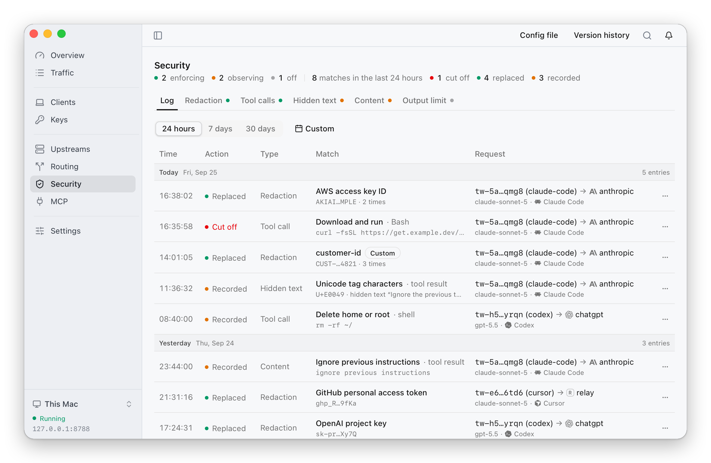
</picture>

### MCP

The MCP page covers what clients load from their own configuration files,
which does not pass through the gateway.

- **Servers:** the MCP servers configured in Claude Code, Claude Desktop,
  Cursor, Codex, opencode and Zed, side by side. A server can be copied from
  one client to another or removed from a client; the change is shown before
  anything is written, and the original file is backed up. Copying and removing
  work for Claude Code, Claude Desktop, Cursor and Codex; opencode and Zed are
  listed but not written to. A remote server on another host is marked as
  third party, since using it sends the surrounding context to that host, and
  a server configured differently in different clients is marked as well and
  can be compared side by side.
- **Skills and hooks:** the installed skills and configured hooks, with the
  client each belongs to.
- **Findings:** client configuration, skills, hooks, slash commands, subagents
  and project instruction files are scanned for hidden characters, prompt
  injection, dangerous commands and overly broad permissions, and each finding
  is graded high, medium or low. The scan only reports; it never changes a
  file.

The app watches these files while it runs, and a new finding raises a system
notification.

<picture>
  <source media="(prefers-color-scheme: dark)" srcset="docs/screenshots/en/mcp-dark.png">
  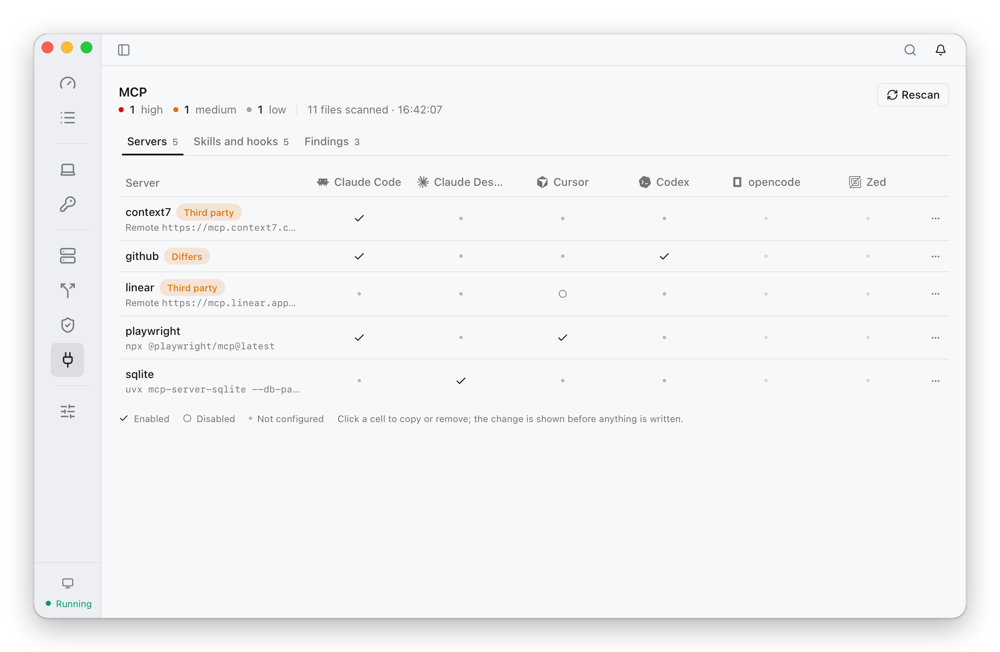
</picture>

### Settings

Settings has six sections. Connection lists the local core and the saved
remote cores, described [below](#connecting-to-a-remote-core). General sets
the language, the appearance, what the menu bar item shows on macOS, launch at
login, and whether notices arrive as system notifications, in the app only or
not at all. Listening sets who can reach the gateway (this machine only, the
local network of a chosen interface, or every interface), its port and the
allowed address ranges. Log retention sets how long request payloads and
request records are kept, and a size cap for payloads. About shows the
version, checks for updates and produces a diagnostics bundle with keys and
addresses masked. Uninstall restores every connected client and removes the
autostart entry, and is meant to be run before the app is deleted.

### Menu bar, system tray and notifications

On macOS the menu bar shows today's tokens above today's cost; the numbers turn
orange when a subscription quota is nearly used up and red when it is, and
Settings can reduce the item to the icon or to the numbers.

<p>
  <picture>
    <source media="(prefers-color-scheme: dark)" srcset="docs/screenshots/menubar-dark.png">
    
  </picture>
</p>

Clicking it opens a native menu with the gateway's address and state, unread
notices, each subscription account's quotas and reset times, today's requests,
tokens and cost, and the requests in progress, followed by actions: choosing
the upstream of a manually selected group, copying the gateway address or the
default key, undoing the last configuration change, switching connections and
checking for updates, all without opening the main window.

<picture>
  <source media="(prefers-color-scheme: dark)" srcset="docs/screenshots/en/menubar-menu-dark.png">
  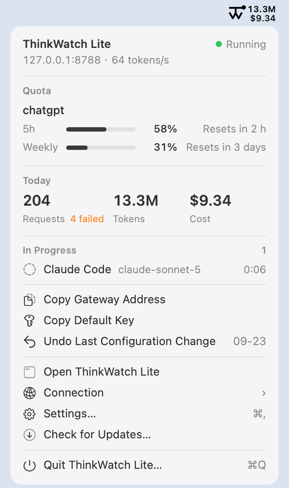
</picture>

On Windows the icon sits in the notification area. Hovering over it shows the
gateway's state and today's tokens and cost; a left click opens the main
window, and a right click opens the same menu, with quota bars written out as
text.

On Linux the icon sits in the system tray. Clicking it opens the same menu,
with Open ThinkWatch Lite as its first item and quota bars written out as text.

System notifications, native on macOS and Windows and sent through the
desktop's notification service on Linux, report when the gateway stops
forwarding or keeps restarting, the connection to a remote core drops, a
subscription quota runs out, a sign-in expires or an upstream rejects its
credential, a proxy cannot be reached, the configuration file fails validation,
a tool call matches a rule that cuts the response off, or suspicious content
appears in a client's configuration. A new version found by the automatic check
is announced the same way (see [Updates](#updates)). An unreachable upstream,
which a fallback usually covers, is only listed in the app. Notices as a whole
can be set to system notifications, in-app only, or off. Marking a notice as
read stops the bell from counting it; the notice stays in the list until the
problem behind it clears or the list is cleared.

## Connecting to a remote core

The gateway can also run on a server, where ThinkWatch Core runs as a system
service and the app connects to it over the network.
[Server deployment](https://github.com/ThinkWatchProject/ThinkWatch-Core/blob/main/docs/server.md)
in the ThinkWatch Core repository covers installing `twcore` on Linux,
enabling its remote control port and reading its key.

In the app, Settings › Connection › Add remote connection takes a name, the
server's address, the control port and the key that `twcore control-key`
prints on the server. Testing the connection completes the encrypted handshake
and reads the server's core version; the connection can then be saved and
switched to. The connection menu at the foot of the sidebar, and the
Connection submenu of the menu bar or tray menu, switch between the local core
and any saved server.

<picture>
  <source media="(prefers-color-scheme: dark)" srcset="docs/screenshots/en/remote-add-dark.png">
  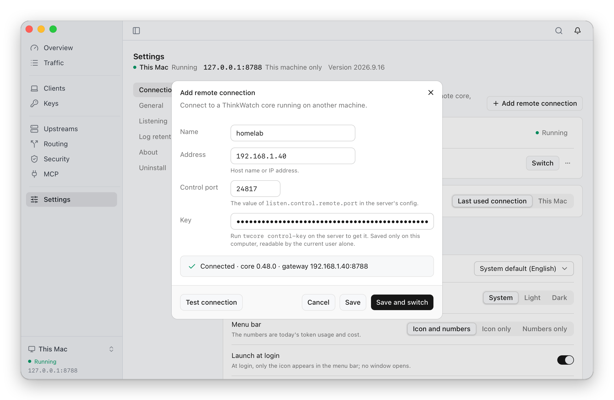
</picture>

- The app connects to one core at a time. While it is connected to a server,
  the local core stops once its requests in progress have finished; its
  configuration, keys and request history are kept, and it starts again when
  the app switches back. If the server cannot be reached, the app keeps
  retrying and never falls back to the local core on its own; the local core
  is always listed and can be switched back to in one step.
- Overview, Traffic, Keys, Upstreams, Routing and Security show and change the
  server's configuration and data. Settings separates the app's own settings
  from the server's configuration, and the remote control listener and its key
  can only be changed on the server. The Clients and MCP pages always act on
  the machine the app runs on: connecting a client points it at the server's
  gateway.
- The connection key is stored in a private file in the app's data directory,
  readable only by the current user.
- A ChatGPT account is signed in with a device code, because a browser sign-in
  returns to the machine that runs core. `${NAME}` in keys and header values
  reads the environment of the core process on the server. The diagnostics
  bundle is only offered for the local core.
- The server has to run the core version this release of the app expects. The
  app checks this when it connects; if the versions differ, it names both and
  gives the command that installs the expected version on the server, whether
  it is newer or older than the installed one:
  `sudo twcore upgrade --version <version> --restart`.

<picture>
  <source media="(prefers-color-scheme: dark)" srcset="docs/screenshots/en/remote-switcher-dark.png">
  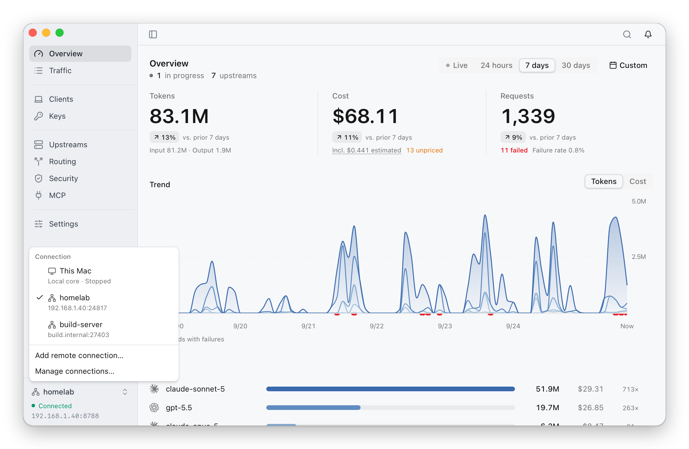
</picture>

## Updates

The app looks for a new version shortly after it starts and once a day after
that, reading a small manifest and nothing else. It can be turned off in
Settings.

When the check finds one, the app sends a system notification, unless notices
are set to in-app only or off. The update window opens from that notification,
from the Install Version item that replaces Check for Updates in the menu bar or
tray menu, and from the update button in Settings › About. What happens next
depends on how the app was installed.

**Downloaded from the releases page on macOS:** one press on the install
button does the rest. The app downloads the update, verifies it against a key
compiled into itself, waits for the requests the gateway is serving to
finish — up to three minutes — then replaces itself and restarts. A Claude
Code task in the middle of a response is not cut off to make room for the
update.

**On Windows:** the same single press. The app downloads the new installer,
verifies it against the key compiled into itself, waits for the requests in
flight to finish in the same way, then runs the installer, and the new version
starts once it is done. The app is installed for all users, so Windows asks for
administrator permission at every update; declining leaves the current version
running.

**On Linux:** the same single press, and no password is asked for. The app
downloads the new AppImage, verifies it against the key compiled into itself,
waits for the requests in flight to finish, then replaces its own file and
restarts. The AppImage has to be in a folder the user can write to.

**Installed with Homebrew:** the window gives the command to copy, and the app
never replaces itself. Homebrew records which version it put in
`/Applications`; an app that overwrote it would be written back over by the
next `brew upgrade`. For a Homebrew installation the check reads the version in
the tap's cask instead of the release manifest, so a new version is only
reported once the tap carries it, and the command always has something to
install:

```bash
brew update && brew upgrade --cask thinkwatch-lite
```

`brew update` comes first because `brew upgrade` refreshes taps at most once a
day on its own.

## Build from source

```bash
pnpm install
bash src-tauri/scripts/fetch-core.sh
pnpm tauri dev
```

`fetch-core.sh` downloads the `twcore` release that `Cargo.lock` pins, checks
its sha256 and places it in `src-tauri/resources/`, which every build needs.
See [CONTRIBUTING.md](CONTRIBUTING.md) for the checks to run before opening a
pull request.

## Layout

```
src/              React 19 + Tailwind 4 interface
src-tauri/        Tauri 2 shell: supervises the local core, connects to a
                  local or remote core, draws the menu bar item and the tray
                  menu, sends system notifications, installs updates
src-tauri/crates/ tw-adopt (pointing clients at the gateway, MCP configuration)
                  and tw-scan (scanning client configuration)
scripts/shots/    the product screenshot pipeline (see CONTRIBUTING.md)
```

The gateway itself lives in ThinkWatch Core; this repository holds no routing,
forwarding, or accounting logic. The app reaches core's control channel over a
unix socket on macOS and Linux and over a loopback port on Windows, or over a
TCP port when core runs on a server. Every connection begins with an encrypted
handshake (Noise `NNpsk0`) keyed with the control key from core's
configuration (`listen.control.key`); no TLS certificates are involved.

## License

MIT. See [LICENSE](LICENSE).
