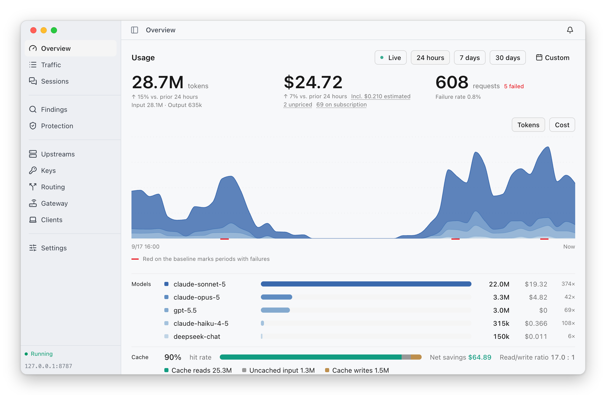
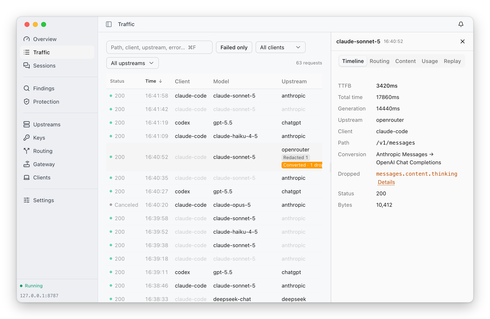
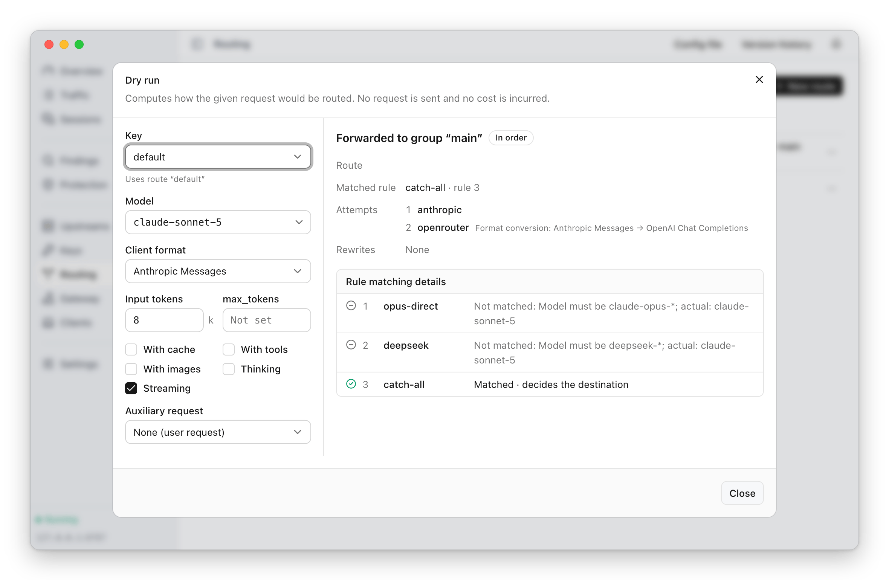
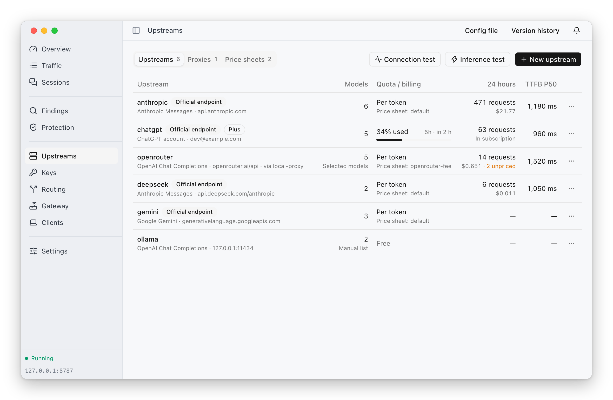
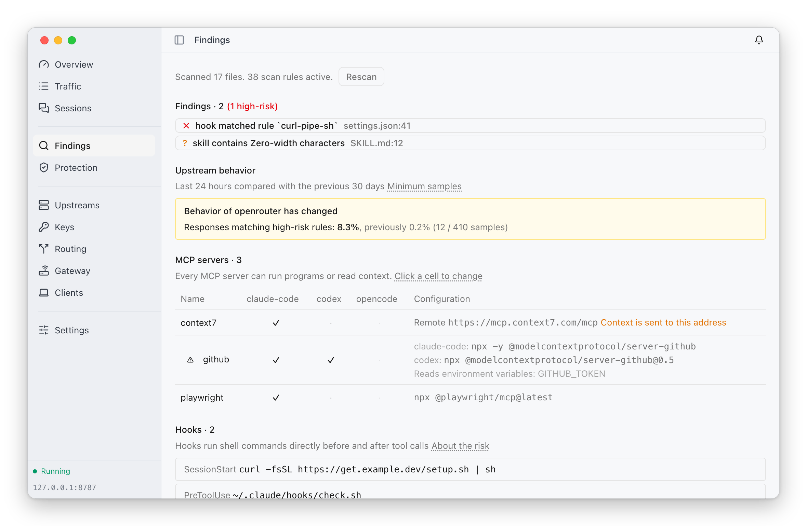
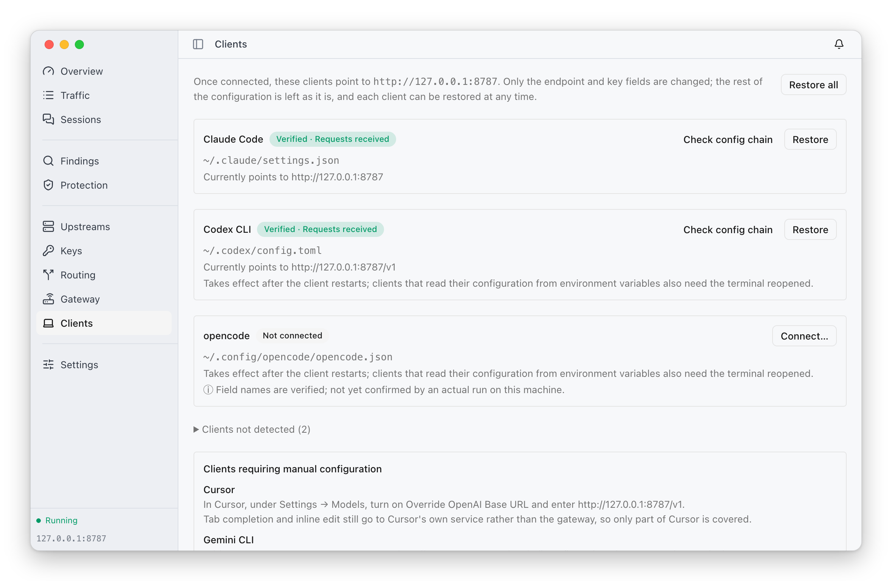

<p align="center">
  
  
  
  
</p>

# ThinkWatch Lite

**[English](README.md) | [中文](README.zh-CN.md)**

ThinkWatch Lite is a macOS menu-bar app that runs a local AI API gateway.
Claude Code, Codex CLI and other clients of the Anthropic, OpenAI and Gemini
APIs send their requests to the gateway, and Lite shows what each request
cost, which upstream served it and why, and what was sent along with it.

It runs on macOS 12 or later on Apple Silicon. Other platforms follow once the
macOS version is complete.

## Install

```bash
brew install --cask thinkwatchproject/tap/thinkwatch-lite
```

The gateway, [ThinkWatch Core](https://github.com/ThinkWatchProject/ThinkWatch-Core),
ships inside the app; nothing else needs to be installed.

A disk image is also available from the
[releases page](https://github.com/ThinkWatchProject/ThinkWatch-Lite/releases):
download `ThinkWatch-Lite-<version>-arm64.dmg`, check it against the sha256
published beside it, and drag ThinkWatch Lite into Applications. The app is
**not signed by a registered Apple developer**, so macOS quarantines a
downloaded copy and refuses to open it until the attribute is removed:

```bash
xattr -dr com.apple.quarantine "/Applications/ThinkWatch Lite.app"
```

The same can be done without a terminal: after the first refused launch,
choose Open Anyway in System Settings › Privacy & Security. Removing that
attribute is the only thing
[the cask](https://github.com/ThinkWatchProject/homebrew-tap) does beyond
copying the app out of the disk image.

## Features

### Usage and cost

Tokens, cost and requests over any period, broken down by model, with the cache
hit rate, the net savings from caching and latency percentiles per model.
Measured costs, estimated costs and unpriced requests are reported separately
and never added together; usage served by subscription upstreams is counted
apart from billed usage; every request records the price sheet and the date of
the prices it was costed with.

<picture>
  <source media="(prefers-color-scheme: dark)" srcset="docs/screenshots/overview-en-dark.png">
  
</picture>

### Routing and failover

Routing rules send requests to an upstream or a group of upstreams by model,
key, token count, tools, images and other properties. Every request records
the rule it matched, the group it went through and each attempt with its
status and duration.

<picture>
  <source media="(prefers-color-scheme: dark)" srcset="docs/screenshots/requests-en-dark.png">
  
</picture>

A dry run evaluates the rules for a given request and shows where it would go
and why, without sending anything and without incurring any cost.

<picture>
  <source media="(prefers-color-scheme: dark)" srcset="docs/screenshots/dry-run-en-dark.png">
  
</picture>

### Upstreams

API keys, a ChatGPT account signed in from the app (with its usage limits and
reset times), relays such as OpenRouter, and local models. When a client and an
upstream speak different API formats, requests are converted between Anthropic
Messages, OpenAI Chat Completions, OpenAI Responses and Gemini, and the fields
that cannot be carried over are listed. Upstreams can be reached through an
outbound proxy and priced with a custom price sheet.

<picture>
  <source media="(prefers-color-scheme: dark)" srcset="docs/screenshots/upstreams-en-dark.png">
  
</picture>

### Security

- **Outbound redaction** replaces keys, private keys and connection strings
  before a request leaves for an untrusted upstream, and restores them in the
  response.
- **Tool-call inspection** cuts off the response stream when an upstream returns
  a tool call carrying a command that would grant code execution.
- **Config scan** checks client configuration files (skills, hooks, MCP servers)
  for hidden characters, injected instructions and dangerous commands.

Each runs in Off, Observe or Enforce mode, and all three start in Observe. The
Findings page collects the scan results and compares each upstream's last 24
hours with the 30 days before.

<picture>
  <source media="(prefers-color-scheme: dark)" srcset="docs/screenshots/findings-en-dark.png">
  
</picture>

### Client setup

Claude Code, Codex CLI, opencode, Zed and Aider can be pointed at the gateway
from the app. The change is shown as a diff before anything is written, the
original file is backed up, only the endpoint and key fields change, and the
change can be restored at any time. Cursor, Continue and Gemini CLI come with
step-by-step instructions.

<picture>
  <source media="(prefers-color-scheme: dark)" srcset="docs/screenshots/clients-en-dark.png">
  
</picture>

### Menu bar and notifications

The menu bar shows today's cost and the output rate; for a subscription account
it shows the quota used and the time until it resets instead. System
notifications report when the gateway stops forwarding, an upstream becomes
unreachable, a subscription quota runs out or a credential stops working; each
kind can be set to a system notification, in-app only, or off.

<p>
  <picture>
    <source media="(prefers-color-scheme: dark)" srcset="docs/screenshots/menubar-cost-dark.png">
    
  </picture>
  <picture>
    <source media="(prefers-color-scheme: dark)" srcset="docs/screenshots/menubar-quota-dark.png">
    
  </picture>
</p>

## Updates

The app looks for a new version shortly after it starts and once a day after
that, reading a small manifest and nothing else. It can be turned off in
Settings.

When there is one, a small window says so, and what happens next depends on how
the app was installed.

**Downloaded from the releases page:** one press on the install button does the
rest. The app downloads the update, verifies it against a key compiled into
itself, waits for the requests the gateway is serving to finish — up to three
minutes — then replaces itself and restarts. A Claude Code task in the middle
of a response is not cut off to make room for the update.

**Installed with Homebrew:** the window gives the command to copy, and the app
never replaces itself. Homebrew records which version it put in
`/Applications`; an app that overwrote it would be written back over by the
next `brew upgrade`. The window only appears once the tap carries the new
version, so the command always has something to install:

```bash
brew update && brew upgrade --cask thinkwatch-lite
```

`brew update` comes first because `brew upgrade` refreshes taps at most once a
day on its own.

## Build from source

```bash
pnpm install
pnpm tauri dev
```

See [CONTRIBUTING.md](CONTRIBUTING.md) for the checks to run before opening a
pull request.

## Layout

```
src/              React 19 + Tailwind 4 frontend
src-tauri/        Tauri 2 shell: supervises core, renders the menu bar
```

The gateway itself lives in ThinkWatch Core; this repository holds no routing,
forwarding, or accounting logic. It talks to core over a unix socket.

## License

MIT. See [LICENSE](LICENSE).
