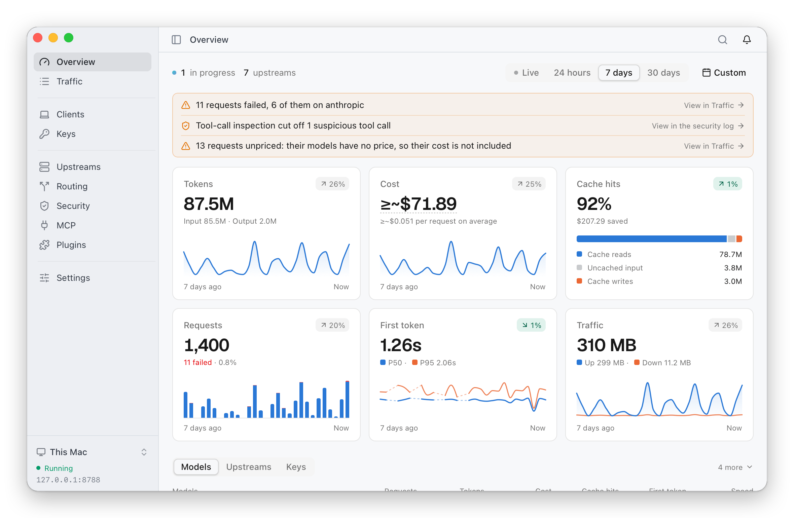
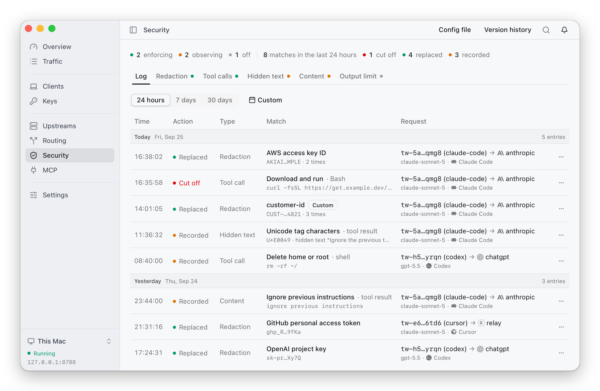

<p align="center">
  <picture>
    <source media="(prefers-color-scheme: dark)" srcset="docs/brand/logo-dark.png">
    
  </picture>
</p>

<p align="center">
  
  
  
  
  
  
  <a href="https://linux.do"></a>
</p>

# ThinkWatch Lite

**[English](README.md) | [中文](README.zh-CN.md)**

A local gateway for Claude Code, Codex and other AI clients, on macOS, Windows
and Linux. Each client is connected once; after that, upstreams and models
change without touching its configuration. Every request is recorded with its
cost and route; the API keys in it can be replaced before it leaves the
machine, and dangerous tool calls a relay slips into an answer can be cut off
before the client runs them.

**Sponsors:** [Want to appear here?](mailto:fylorn@outlook.com?subject=ThinkWatch%20Lite%20Sponsorship)

<picture>
  <source media="(prefers-color-scheme: dark)" srcset="docs/screenshots/en/overview-dark.png">
  
</picture>

## Highlights

- **Connect once, switch freely.** Claude Code, Claude Desktop, Codex,
  opencode, Pi, oh-my-pi, Grok Build, Qwen Code, Hermes Agent, Zed, Aider and
  DeepSeek Harness are pointed at the gateway in one step, with the change
  previewed, the original file backed up and a restore always available;
  Cursor, Continue and Antigravity CLI come with instructions. Switching
  upstreams then happens in the gateway alone.
- **Protection against relays.** A relay sees every request in full and can
  rewrite every answer. Outbound redaction swaps API keys, private keys, JWTs,
  connection-string passwords, Chinese resident ID numbers and bank card numbers
  for placeholders before a request leaves, so the relay never holds the real
  values. When an answer carries a tool call
  that downloads and runs code, sends out environment variables or credential
  files, reads private keys or installs a startup item or scheduled job,
  tool-call inspection cuts the answer off before the client can run it.
  The content filter deletes instructions hidden in invisible characters before
  a request leaves and can refuse prompt injection. Each protection starts in
  Observe, which only records, and is switched over one at a time.
- **Upstream check-up.** Each upstream is compared with the others serving the
  same model: answers naming a different model, reported input well above or
  below theirs and low prompt-cache reads are marked, with sample sizes.
- **MCP servers, skills and hooks, scanned.** The MCP servers of thirteen
  clients side by side, with third-party servers marked, and a scan of client
  configuration, skills, hooks and project instructions for hidden characters,
  prompt injection, dangerous commands and overly broad permissions.
- **Every request traceable.** The rule a request matched, each upstream it
  tried, any conversion between API formats and how its cost was calculated;
  a finished request can be replayed against another upstream and compared
  side by side. The whole history can be searched, including the text of
  requests and answers.
- **Routing and failover.** Rules by model, tools, images, extended thinking
  and more. When an upstream fails before the answer begins the next one takes
  over, and each session stays on one upstream so its prompt cache keeps
  hitting. Auxiliary requests such as title generation can be answered locally.
- **Any upstream, any API format.** API keys, Amazon Bedrock, ChatGPT and Z.ai
  accounts, relays such as OpenRouter and local models, with conversion between
  the Anthropic, OpenAI and Gemini APIs.
- **Costs stated as they are.** Estimated amounts are marked and requests
  without a price are counted separately instead of as zero.
- **Remote core.** The gateway can also run on a Linux server; the app
  connects to it over an encrypted control channel.

<picture>
  <source media="(prefers-color-scheme: dark)" srcset="docs/screenshots/en/security-dark.png">
  
</picture>

## Install

| Platform | Install |
|---|---|
| macOS 12 or later, Apple silicon | `brew install --cask thinkwatchproject/tap/thinkwatch-lite`, or [`ThinkWatch-Lite-<version>-darwin-arm64.dmg`](https://github.com/ThinkWatchProject/ThinkWatch-Lite/releases/latest) |
| Windows 10 21H2 or later, x64 | Installer [`ThinkWatch-Lite-<version>-windows-x64-setup.exe`](https://github.com/ThinkWatchProject/ThinkWatch-Lite/releases/latest), or portable [`ThinkWatch-Lite-<version>-windows-x64-portable.zip`](https://github.com/ThinkWatchProject/ThinkWatch-Lite/releases/latest) |
| Windows 10 21H2 or later, ARM64 | Installer [`ThinkWatch-Lite-<version>-windows-arm64-setup.exe`](https://github.com/ThinkWatchProject/ThinkWatch-Lite/releases/latest), or portable [`ThinkWatch-Lite-<version>-windows-arm64-portable.zip`](https://github.com/ThinkWatchProject/ThinkWatch-Lite/releases/latest) |
| Linux, x86_64 or aarch64 | `curl -fsSL https://github.com/ThinkWatchProject/ThinkWatch-Lite/releases/latest/download/install.sh \| sh`, or [`ThinkWatch-Lite-<version>-linux-<arch>.AppImage`](https://github.com/ThinkWatchProject/ThinkWatch-Lite/releases/latest) |

The gateway, [ThinkWatch Core](https://github.com/ThinkWatchProject/ThinkWatch-Core),
ships inside the app. The app is not signed by Apple or Microsoft, so the
first launch needs one extra step; [Install and update](https://thinkwat.ch/docs/lite/install)
covers it, along with how updates arrive. The interface is in English and
Simplified Chinese, and the app updates itself (a Homebrew installation
updates through Homebrew).

### Windows portable

Unzip and run `ThinkWatch Lite.exe`: no installation and no administrator
rights. Configuration, keys and request history stay in the `data\` folder next
to the program, apart from the installed copy's data, so the two keep separate
settings. The folder has to be writable.

Only one of the installed and portable copies runs at a time; opening the other
one offers to stop the running one and start it instead. `thinkwatch://` links
and launch at login always point to the copy that is running.

The portable copy has no system uninstaller. Uninstall it in Settings › Full
uninstall first, which restores connected clients and removes its launch at
login and other registry entries, then delete the whole folder.

### Uninstall

Uninstalling in Settings › Full uninstall restores connected clients, turns off
launch at login and can delete the data directory as well. Afterwards, move the
app to the Trash on macOS, or delete the AppImage file on Linux.

The installed copy on Windows can also be uninstalled through the system: the
uninstaller closes ThinkWatch Lite and does the same restoring and cleanup
first. With "Also delete data (configuration, API keys, request history)"
ticked it deletes `%APPDATA%\ThinkWatch` too, except when a client could not be
restored, in which case the data directory, with that client's backup, is kept.
The uninstaller runs as an administrator: when a standard account uninstalls
with an administrator's password, it restores the administrator's clients and
deletes the administrator's data instead, so uninstall in the app first in that
case.

## Documentation

- [Features](https://thinkwat.ch/docs/lite/features): every page, in detail
- [Install and update](https://thinkwat.ch/docs/lite/install)
- [Connecting to a remote core](https://thinkwat.ch/docs/lite/remote-core) and
  [server deployment](https://thinkwat.ch/docs/core/server-deployment)
- [Import links](https://thinkwat.ch/docs/lite/import-links), for relays and vendors
- [Architecture](https://thinkwat.ch/docs/lite/architecture)

## Build from source

```bash
pnpm install
bash src-tauri/scripts/fetch-core.sh
pnpm tauri dev
```

`fetch-core.sh` downloads the `twcore` release that `Cargo.lock` pins into
`src-tauri/resources/`. See [CONTRIBUTING.md](CONTRIBUTING.md) for the layout
of the repository and the checks to run before opening a pull request.

## License

MIT. See [LICENSE](LICENSE).
