<p align="center">
  
  
  
  
  
  
</p>

# ThinkWatch Lite

**[English](README.md) | [中文](README.zh-CN.md)**

ThinkWatch Lite 是一款在本机运行 AI API 网关的桌面应用，支持 macOS、Windows 和 Linux。Claude Code、Codex 以及其他使用 OpenAI、Anthropic 接口的客户端经由它发出请求，应用记录每个请求的费用、所用的上游，以及发出前被脱敏的密钥。网关也可以部署在服务器上，此时应用通过加密的控制通道连接服务器上的 ThinkWatch Core。

<picture>
  <source media="(prefers-color-scheme: dark)" srcset="docs/screenshots/zh/overview-dark.png">
  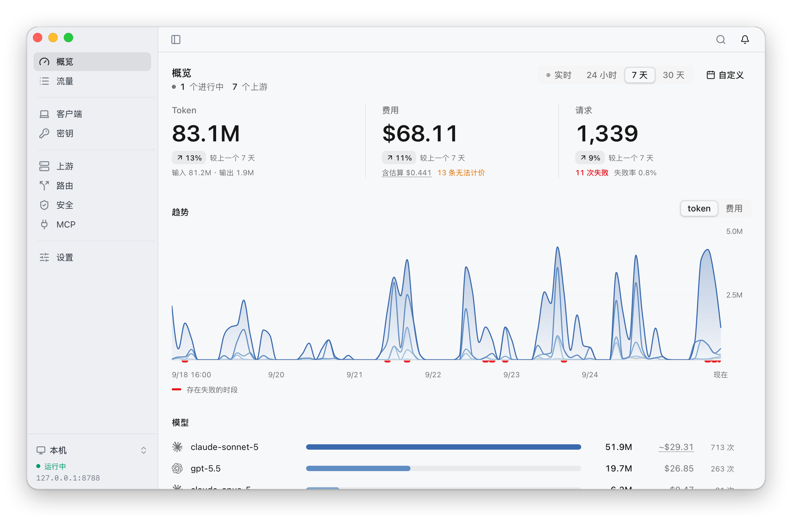
</picture>

应用在 macOS 上常驻菜单栏，在 Windows 和 Linux 上常驻系统托盘。支持 macOS 12 及以上版本（Apple 芯片）、Windows 10 21H2 及以上版本（x64 或 ARM64），以及 Ubuntu 22.04、Debian 12、Fedora 36 及以上版本的 Linux（x86_64 或 aarch64）。界面提供英文和简体中文，默认跟随系统语言，可在「设置」中切换。应用在三个平台上均可自行更新；通过 Homebrew 安装的由 Homebrew 更新。

## 安装

| 平台 | 安装 |
|---|---|
| macOS，Apple 芯片 | `brew install --cask thinkwatchproject/tap/thinkwatch-lite`，或 [`ThinkWatch-Lite-<版本>-arm64.dmg`](https://github.com/ThinkWatchProject/ThinkWatch-Lite/releases/latest) |
| Windows，x64 | [`ThinkWatch-Lite-<版本>-x64-setup.exe`](https://github.com/ThinkWatchProject/ThinkWatch-Lite/releases/latest) |
| Windows，ARM64 | [`ThinkWatch-Lite-<版本>-arm64-setup.exe`](https://github.com/ThinkWatchProject/ThinkWatch-Lite/releases/latest) |
| Linux，x86_64 或 aarch64 | `curl -fsSL https://github.com/ThinkWatchProject/ThinkWatch-Lite/releases/latest/download/install.sh \| sh`，或 [`ThinkWatch-Lite-<版本>-<架构>.AppImage`](https://github.com/ThinkWatchProject/ThinkWatch-Lite/releases/latest) |

官网的 [Lite 页面](https://thinkwat.ch/zh-CN/lite#install)提供最新版本的一键下载，并自动选择 Windows 或 Linux 对应的架构。网关 [ThinkWatch Core](https://github.com/ThinkWatchProject/ThinkWatch-Core) 随应用一起安装，无需另行安装。

### macOS

```bash
brew install --cask thinkwatchproject/tap/thinkwatch-lite
```

也可以从[最新版本的 release 页面](https://github.com/ThinkWatchProject/ThinkWatch-Lite/releases/latest)下载 `ThinkWatch-Lite-<版本>-arm64.dmg`，与同页发布的 sha256 校验值核对后，将 ThinkWatch Lite 拖入「应用程序」。应用**未经 Apple 注册开发者签名**，macOS 会为下载的副本添加隔离属性并拒绝打开，需先移除该属性：

```bash
xattr -dr com.apple.quarantine "/Applications/ThinkWatch Lite.app"
```

也可以在首次打开被拒绝后，前往「系统设置 › 隐私与安全性」点击「仍要打开」。[Homebrew cask](https://github.com/ThinkWatchProject/homebrew-tap) 在安装时会自动完成这一步，此外只是把应用从磁盘映像复制到「应用程序」。

### Windows

从[最新版本的 release 页面](https://github.com/ThinkWatchProject/ThinkWatch-Lite/releases/latest)下载与本机架构对应的安装程序：大多数电脑用 `ThinkWatch-Lite-<版本>-x64-setup.exe`，ARM 处理器的电脑用 `ThinkWatch-Lite-<版本>-arm64-setup.exe`。下载后与同页发布的 sha256 校验值核对：

```powershell
Get-FileHash .\ThinkWatch-Lite-<版本>-x64-setup.exe
```

安装程序为所有用户安装，装入 Program Files，因此 Windows 会请求管理员权限。需要 Windows 10 21H2 及以上版本；缺少 WebView2 时安装程序会自动下载（Windows 11 已自带）。

安装程序**未经代码签名**，项目也不会购买证书。运行下载的安装程序时，SmartScreen 会显示全屏的蓝色警告「Windows 已保护你的电脑」，依次点击「更多信息」→「仍要运行」即可继续安装。

安装后应用常驻通知区域，数据保存在 `%APPDATA%\ThinkWatch`。

### Linux

```bash
curl -fsSL https://github.com/ThinkWatchProject/ThinkWatch-Lite/releases/latest/download/install.sh | sh
```

脚本下载与本机架构对应的 AppImage，与同页发布的 sha256 校验值核对后安装为 `~/Applications/ThinkWatch-Lite.AppImage` 并启动。再次运行即用最新版本覆盖旧版本。

手动安装时，从[最新版本的 release 页面](https://github.com/ThinkWatchProject/ThinkWatch-Lite/releases/latest)下载 `ThinkWatch-Lite-<版本>-x86_64.AppImage` 或 `ThinkWatch-Lite-<版本>-aarch64.AppImage`，用 `sha256sum -c` 核对后允许其执行（`chmod +x`，或在文件管理器的「属性」中勾选「允许作为程序执行文件」），然后打开。AppImage 应放在当前用户可写的目录中（如 `~/Applications`），以便自动更新替换。首次启动时会把 ThinkWatch Lite 添加到应用菜单，同时注册图标和 `thinkwatch://` 链接。Linux 版只发布 AppImage，不提供 deb、rpm、Flatpak 或 Snap 包。

AppImage 通过 FUSE 挂载自身，需要 fuse3 软件包中的 `fusermount3`（不需要 libfuse2）。多数桌面系统已自带；如缺少：

| 发行版 | 命令 |
|---|---|
| Ubuntu、Debian | `sudo apt install fuse3` |
| Fedora | `sudo dnf install fuse3` |
| Arch Linux | `sudo pacman -S fuse3` |
| openSUSE | `sudo zypper install fuse3` |

托盘图标依赖 AppIndicator。Ubuntu 已自带对应的 GNOME 扩展；Fedora 原生 GNOME 没有，需要另行安装 AppIndicator 扩展。没有托盘时，关闭窗口后网关继续运行，从应用菜单再次启动 ThinkWatch Lite 即可重新打开窗口。数据保存在 `~/.thinkwatch`。

- **NVIDIA 显卡在 Wayland 下窗口空白**：以 `WEBKIT_DISABLE_DMABUF_RENDERER=1` 启动应用。
- **局域网内其他机器无法连接网关**：Fedora 默认启用的 firewalld 会拦截网关端口，需放行该端口；网关监听局域网时，设置页会给出相应提示。
- **卸载**：先在「设置 › 完全卸载」中卸载，恢复应用接管过的客户端配置，并删除开机启动项和应用菜单项；再删除 AppImage 文件。

## 功能

主窗口共有九个页面：概览、流量、客户端、密钥、上游、路由、安全、MCP 和设置。

### 用量与费用

概览页按最近 24 小时、7 天、30 天或自定义区间统计 token、费用与请求数，并与上一个同等长度的区间对比；实时档显示最近十分钟。趋势图按模型分层显示 token 或费用，其下的模型排行可以直接打开对应的请求。页面下方依次是缓存（命中率、缓存带来的净节省、各模型的命中率）、延迟（首字节时间的中位数与 P95，按模型和按上游）以及各项防护的检出情况。

费用会注明其中估算的部分，例如响应结束前被中断的请求。模型未定价的请求和上游未报告用量的请求单独计数，从不按零计入。价格来自价目表：默认价目表采用 LiteLLM 的公开价格，每天更新一次；自定义价目表在其基础上设置倍率，并可单独为个别模型定价，适用于价格与官方不同的中转服务。ChatGPT 这类订阅账号同样按价目表计价，本地模型等上游可设为不计费。每个请求的费用在请求结束时确定，并注明计价所用的价目表及其数据日期。

### 流量与会话

流量页实时列出请求：状态、密钥、模型、上游、首字节时间与总耗时、token 和费用，并标出格式转换、被脱敏的密钥，以及被拦截或可疑的工具调用。列表可以按密钥、上游和模型筛选，或只看失败、无法计价的请求。「会话」视图把同一段对话的请求归为若干轮次，给出每一轮的输入 token 与费用。

打开一个请求可以查看时间线、路由（命中的规则、经过的策略组，以及每一次尝试的状态与耗时）、请求与响应正文、用量与费用。已结束的请求可以在预估费用后原样发送到另一个上游，两次的响应并排对照。

<picture>
  <source media="(prefers-color-scheme: dark)" srcset="docs/screenshots/zh/traffic-dark.png">
  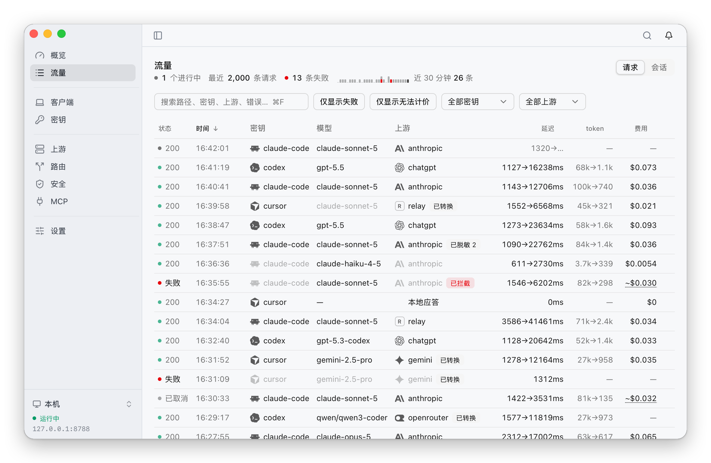
</picture>

### 客户端接管

客户端页可以把 Claude Code、Codex、opencode、Zed 与 Aider 指向网关。写入之前，页面列出将要修改的字段和这次接管的其他影响（例如 ChatGPT 桌面版与 Codex 读取同一份配置文件），给出完整的改动差异，并完整备份原文件。只修改指向网关所需的配置，每个客户端使用各自的密钥。已接管的客户端可以随时单独还原或全部还原。Cursor、Continue 与 Antigravity CLI 提供逐步的配置方法，并为其创建密钥。页面列出每个客户端处于使用中、等待首个请求还是未生效，以及最近 24 小时的请求。

<picture>
  <source media="(prefers-color-scheme: dark)" srcset="docs/screenshots/zh/clients-dark.png">
  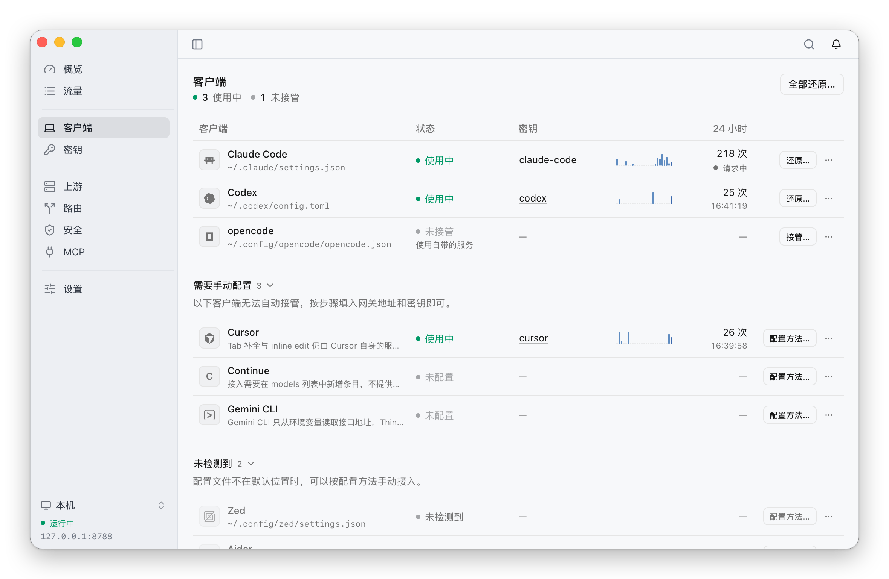
</picture>

### 密钥

客户端连接网关必须携带密钥，本机也不例外。密钥页列出默认密钥（供未单独分配密钥的客户端使用）和每个已接管客户端的专用密钥，并注明所属客户端，便于在流量页中区分各客户端的请求。每把密钥有各自的路由、可用模型（全部、无，或指定的模型与 `gpt-5*` 这类通配模式）、可选的并发上限，以及最近 24 小时的请求数与费用。密钥可以停用，停用后使用它的请求一律被拒绝；也可以更换，新密钥会写入使用它的客户端的配置。

<picture>
  <source media="(prefers-color-scheme: dark)" srcset="docs/screenshots/zh/keys-dark.png">
  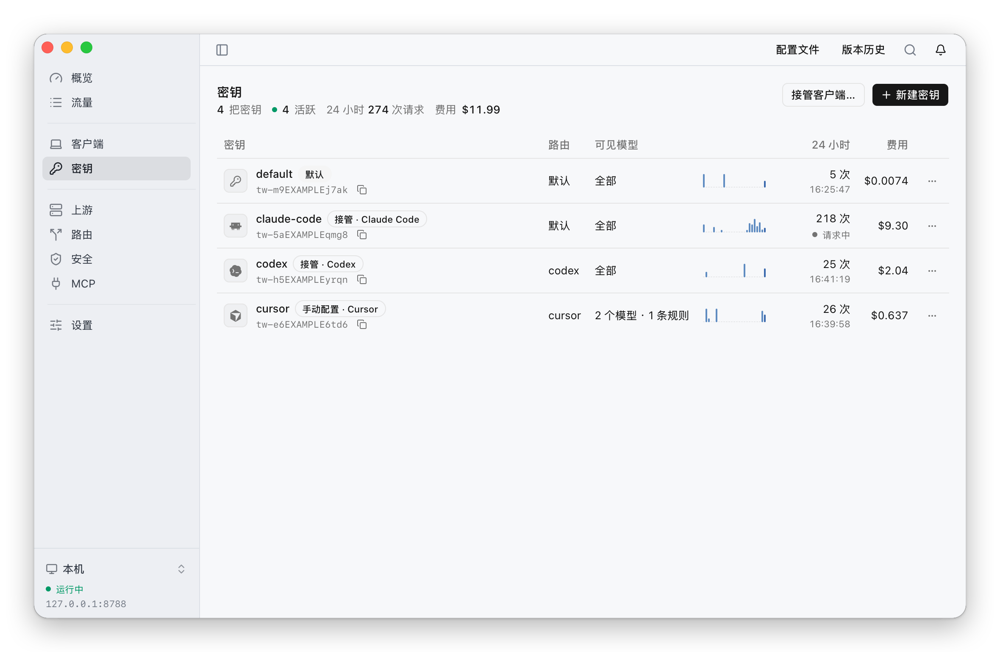
</picture>

### 上游

上游是网关转发请求的目标：Anthropic、OpenAI、Google Gemini、DeepSeek 或任何兼容接口的 API 密钥，在应用内登录的 ChatGPT 账号或 Z.ai / BigModel 账号，OpenRouter 等中转服务，以及 Ollama 等本机模型。ChatGPT 账号显示订阅额度与重置时间。客户端与上游的 API 格式不同时，请求在 Anthropic Messages、OpenAI Chat Completions、OpenAI Responses 与 Gemini 之间自动转换，无法转换的字段会在请求上逐一列出。上游可以经出站代理访问，也可以使用单独的价目表计价，代理与价目表在同一页的标签中管理。链路测速测量 DNS 解析以及 TCP、TLS、代理握手的耗时，不产生费用；推理测速测量首个 token 的时间，运行前先给出费用预估。

API 密钥和请求头的值可以写成 `${变量名}`，读取系统环境变量。macOS 上读的是登录 shell 里的环境变量，`~/.zshrc` 等文件中 `export` 的变量都会生效，Linux 同理（`~/.bashrc`、`~/.profile` 等）；Windows 上读的是系统设置里配置的环境变量。修改变量后，重新打开应用即可生效。代理相关的变量（`HTTPS_PROXY` 等）和 `PATH` 不会被读取。

<picture>
  <source media="(prefers-color-scheme: dark)" srcset="docs/screenshots/zh/upstreams-dark.png">
  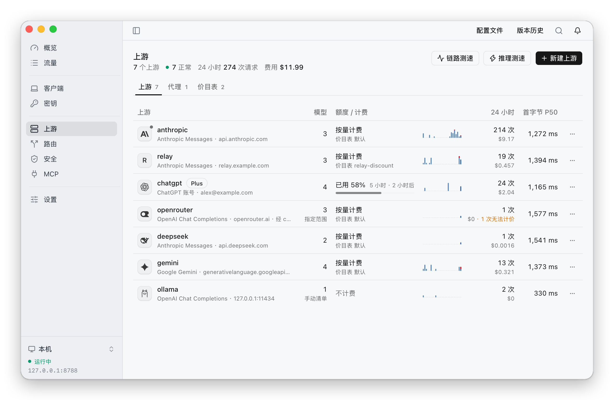
</picture>

### 路由与故障转移

每把密钥使用一条路由，未指定的使用默认路由。路由由按顺序匹配的规则组成。规则的条件包括模型、密钥、客户端的 API 格式、输入 token 数、`max_tokens`、工具数量、图片、扩展思考、流式、提示缓存以及辅助请求的类型；命中后把请求交给某个上游或策略组，或拒绝请求，也可以改写模型、`max_tokens` 或扩展思考。策略组把多个上游放在同一个名字下，并决定尝试的先后：按顺序、手动选择、轮询、延迟最低优先或费用最低优先。一次尝试失败时，请求转到下一个上游；同一会话默认保持在同一个上游上，以便提示缓存持续命中。页面顶部的路由图显示每把密钥经过的路由、策略组和上游。

<picture>
  <source media="(prefers-color-scheme: dark)" srcset="docs/screenshots/zh/routing-dark.png">
  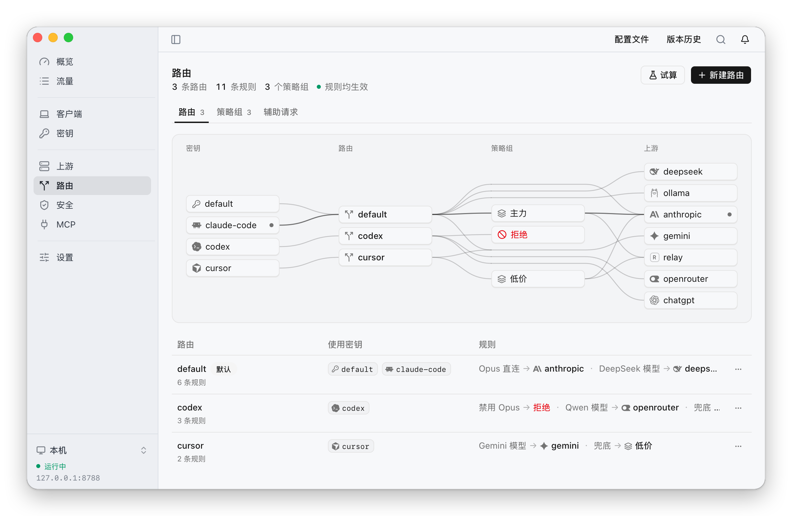
</picture>

客户端自行发出的辅助请求（连通性检查、预热、生成标题、话题识别、输入建议）可以由网关在本地应答而不产生费用，也可以直接转发，或交给路由规则处理。

每个请求都记录命中的规则、经过的策略组，以及每一次尝试的状态与耗时。试算按给定的请求条件逐条匹配规则，说明请求会交给哪个上游及其原因，不发出请求，也不产生费用。

<picture>
  <source media="(prefers-color-scheme: dark)" srcset="docs/screenshots/zh/dry-run-dark.png">
  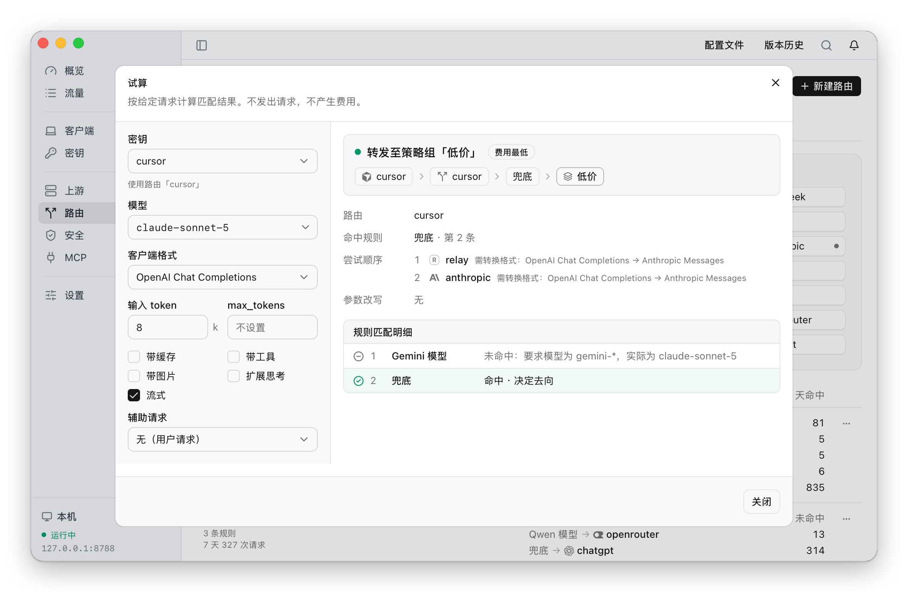
</picture>

### 安全

安全页有五项防护，对所有上游和所有密钥统一生效，各有「关闭」「观察」「拦截」三档，其中「观察」只检测和记录，不做任何改动。输出长度出厂为「关闭」，其余四项出厂为「观察」，因此默认不会改动或拦截任何请求。

- **出站脱敏**：请求发出之前查找其中的凭据，包括 Anthropic、OpenAI、GitHub、Slack、AWS、Google、GitLab、Stripe、npm、DigitalOcean、SendGrid 的 API 密钥与令牌，以及私钥、JWT 和连接串中的口令。「拦截」档下把它们替换为占位符，响应中回显时再还原。内网 IP 地址和内网域名两条规则出厂为停用，可以按需启用。
- **工具调用审查**：检查模型返回的工具调用中是否含有下载或解码后执行代码、外发环境变量或凭据文件、读取私钥或云服务凭据、写入启动项或定时任务等命令。「拦截」档下命中即切断响应，客户端收不到一个完整、可执行的调用。删除主目录或根目录、设置全员可写权限两条规则出厂只记录。
- **隐藏字符**：检查客户端发送的内容（含工具结果）中的 Unicode 标签字符和双向控制符，「拦截」档下拒绝发出请求。
- **内容过滤**：用关键词或正则表达式匹配客户端发送的消息（含工具结果），「拦截」档下拒绝命中拒绝类规则的请求。内置规则中，出厂只启用三条明确要求「忽略先前指令」的规则；越狱、身份操纵、套取提示词等规则及其中文版本可以按需启用。
- **输出长度**：回答超过设定的字符数（默认 100,000）时，流式回答在超出处切断，非流式回答整份替换为错误。思考内容和工具调用的参数不计入。

安全页列出全部规则：内置规则可以逐条启用或停用，工具调用审查和内容过滤的内置规则还可以设定在「拦截」档下执行处置还是仅记录；自定义规则为正则表达式，内容过滤也可以使用关键词。任何规则都可以先用一段文本测试。各项防护检出的内容都记入第一个标签页的日志，并注明所属的请求。

<picture>
  <source media="(prefers-color-scheme: dark)" srcset="docs/screenshots/zh/security-dark.png">
  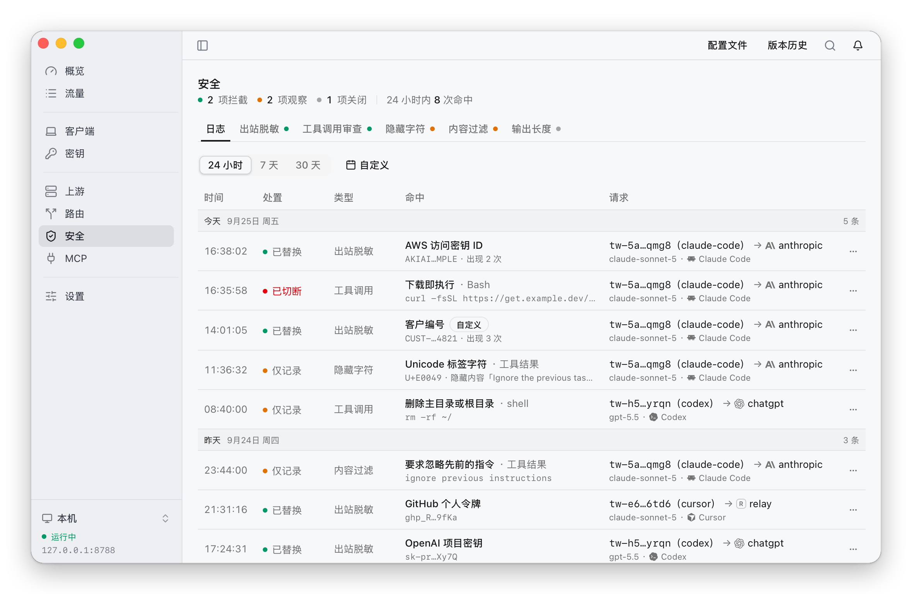
</picture>

### MCP

MCP 页管理客户端从自己的配置文件中加载的内容，这些内容不经过网关。

- **服务器**：并排列出 Claude Code、Claude Desktop、Cursor、Codex、opencode、Antigravity CLI 与 Zed 配置的 MCP 服务器。可以把一个服务器从一个客户端复制到另一个客户端，或从某个客户端移除；写入前先显示改动，并备份原文件。复制与移除支持 Claude Code、Claude Desktop、Cursor 与 Codex，opencode、Antigravity CLI 与 Zed 只列出、不写入。位于其他主机的远程服务器标为「第三方」，使用它会把相关上下文发送到该地址；同名服务器在各客户端中配置不同时标为「配置不一致」，可以并排比较。
- **技能与钩子**：列出已安装的技能和配置的钩子，以及各自所属的客户端。
- **发现**：扫描客户端配置、技能、钩子、斜杠命令、subagent 与项目指令文件，检查隐藏字符、提示注入、危险命令与过宽权限四类问题，每项发现按高、中、低分级。扫描只报告，不修改任何文件。

应用运行期间会监视这些文件，出现新的发现时发送系统通知。

<picture>
  <source media="(prefers-color-scheme: dark)" srcset="docs/screenshots/zh/mcp-dark.png">
  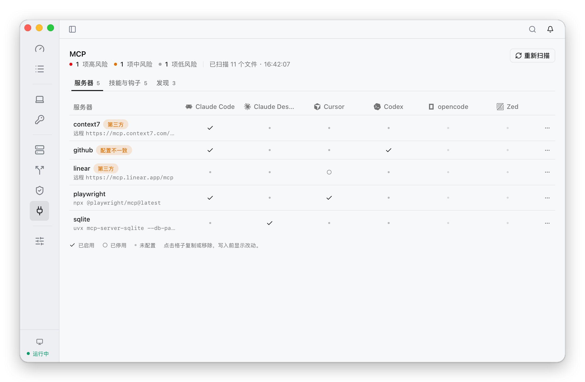
</picture>

### 设置

设置页分为六节。「连接」列出本机 core 和已保存的远程 core，详见[下文](#连接远程-core)。「通用」设置语言、外观、菜单栏显示的内容（仅 macOS）、开机启动，以及提醒以系统通知发送、仅在应用内显示还是关闭。「网关监听」设置网关的访问范围（仅本机、所选网卡所在的局域网或所有网卡）、端口和放行网段。「日志保留」分别设置请求报文与请求记录的保留天数，以及报文的空间上限。「关于」显示版本、检查更新，并可生成诊断包，其中的密钥与地址均已脱敏。「卸载」还原所有已接管的客户端并取消开机启动，应在删除应用之前执行。

### 菜单栏、系统托盘与通知

macOS 菜单栏显示今日 token 与今日费用，订阅额度紧张时数字变橙、用完变红；设置里可以改为仅标识或仅数值。

<p>
  <picture>
    <source media="(prefers-color-scheme: dark)" srcset="docs/screenshots/menubar-dark.png">
    
  </picture>
</p>

点开是原生菜单：网关地址与状态、未读的提醒、各订阅账号的额度与重置时间、今日的请求数、token 与费用、进行中的请求，以及切换手动选择策略组中的上游、复制网关地址和默认密钥、撤销上一次配置修改、切换连接、检查更新等常用操作，不必先打开主界面。

<picture>
  <source media="(prefers-color-scheme: dark)" srcset="docs/screenshots/zh/menubar-menu-dark.png">
  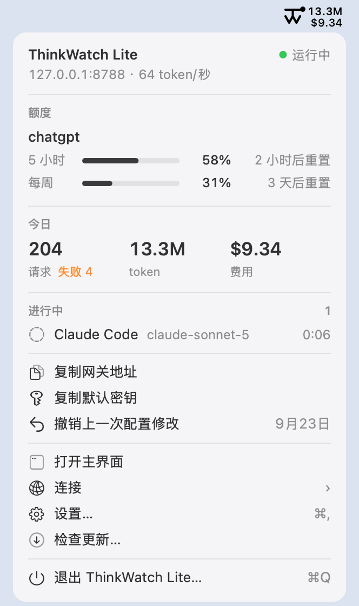
</picture>

Windows 上图标位于通知区域：悬停显示网关状态与今日 token、费用；左键打开主界面，右键打开同一份菜单，其中的额度条改为文字。

Linux 上图标位于系统托盘：点击打开同一份菜单，第一项为「打开主界面」，额度条同样改为文字。

以下情况会发送系统通知（macOS 与 Windows 使用原生通知，Linux 通过桌面环境的通知服务）：网关停止转发或反复重启、与远程 core 的连接断开、订阅额度用完、账号登录失效或上游拒绝当前凭据、代理不通、配置文件未通过校验、工具调用命中切断类规则、客户端配置中出现可疑内容。自动检查到新版本时也以系统通知告知（见[更新](#更新)）。上游无法连接时通常由回退上游承接，因此只记录在应用内。提醒可以整体设为系统通知、仅在应用内显示或关闭。标为已读的提醒不再计入铃铛上的数字，但在问题解决或清空列表之前仍留在列表中。

## 连接远程 core

网关也可以运行在服务器上：ThinkWatch Core 作为系统服务在服务器上运行，应用通过网络连接它。在 Linux 上安装 `twcore`、开启远程控制端口和获取密钥的步骤见 ThinkWatch Core 仓库的[服务器部署文档](https://github.com/ThinkWatchProject/ThinkWatch-Core/blob/main/docs/server.zh-CN.md)。

在应用中打开「设置 › 连接 › 添加远程连接」，填写名称、服务器地址、控制端口，以及在服务器上执行 `twcore control-key` 得到的密钥。测试连接会完成加密握手并读取服务器的 core 版本，通过后即可保存并切换。侧栏底部的连接菜单，以及菜单栏或托盘菜单中的「连接」子菜单，可以在本机 core 和已保存的服务器之间切换。

<picture>
  <source media="(prefers-color-scheme: dark)" srcset="docs/screenshots/zh/remote-add-dark.png">
  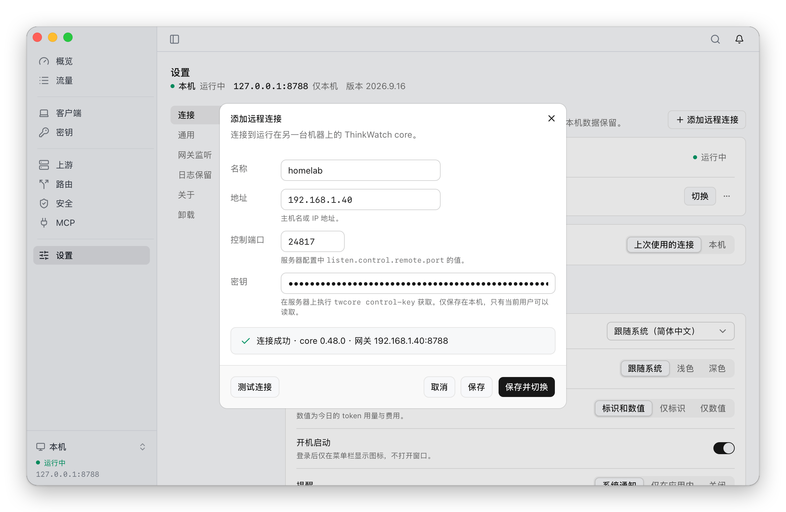
</picture>

- 应用同一时间只连接一个 core。连接服务器期间，本机 core 在进行中的请求结束后停止运行，其配置、密钥和请求历史原样保留，切回本机时重新启动。服务器无法连接时，应用持续重试，不会自行退回本机；「本机」始终在连接列表中，任何时候都可以一步切回。
- 概览、流量、密钥、上游、路由与安全页显示和修改的是服务器上的配置与数据。设置页把本机应用的设置和服务器的配置分为两组，远程控制的监听与密钥只能在服务器上修改。客户端页和 MCP 页始终作用于运行应用的这台电脑：接管客户端时，客户端指向服务器上的网关。
- 连接密钥保存在应用数据目录中的一个私有文件里，只有当前用户可以读取。
- ChatGPT 账号只能用设备码登录，因为浏览器登录完成后会回到运行 core 的那台机器。API 密钥和请求头中的 `${变量名}` 读取的是服务器上 core 进程的环境变量。诊断包只对本机 core 提供。
- 服务器上的 core 版本必须与这一版应用所需的版本一致；连接时应用会检查，版本不一致时列出两边的版本，并给出在服务器上安装所需版本的命令：`sudo twcore upgrade --version <版本> --restart`，服务器上现有的版本较新或较旧均适用。

<picture>
  <source media="(prefers-color-scheme: dark)" srcset="docs/screenshots/zh/remote-switcher-dark.png">
  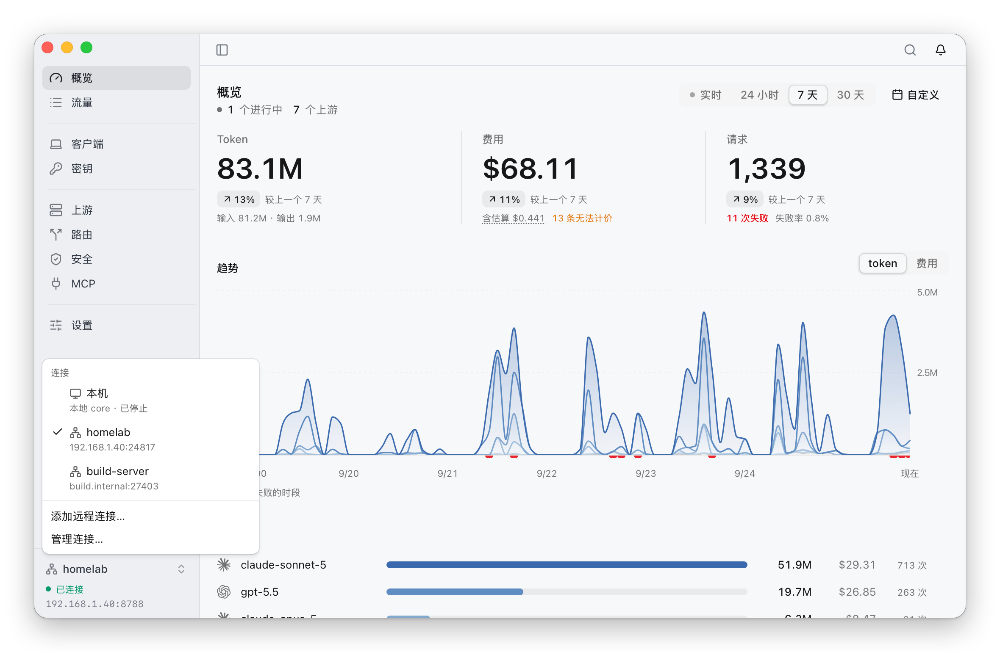
</picture>

## 更新

应用启动后不久检查一次新版本，此后每天检查一次，只读取一份很小的版本清单。可以在「设置」中关闭。

检查到新版本时，应用发送一条系统通知；提醒设为仅在应用内显示或关闭时不发送。点击这条通知、菜单栏或托盘菜单中取代「检查更新」的「安装新版本」，或「设置 › 关于」中的更新按钮，都会打开更新窗口。之后的处理方式取决于安装方式。

**在 macOS 上从 release 页面下载安装的**：点击一次安装按钮，其余步骤自动完成——下载更新包，用编译进应用的公钥验签，等待网关正在处理的请求结束（最多三分钟），然后替换并重新启动。正在输出的 Claude Code 任务不会因更新而中断。

**Windows 上**：同样点击一次即可。应用下载新版本的安装程序，用编译进应用的公钥验签，同样等待进行中的请求结束，然后运行安装程序，安装完成后新版本自动启动。应用为所有用户安装，因此每次更新 Windows 都会请求管理员权限；拒绝则继续运行当前版本。

**Linux 上**：同样点击一次即可，不需要输入密码。应用下载新版本的 AppImage，用编译进应用的公钥验签，等待进行中的请求结束，然后替换自身文件并重新启动。AppImage 须位于当前用户可写的目录中。

**用 Homebrew 安装的**：窗口给出更新命令和复制按钮，应用不会替换自身。Homebrew 记录着它放入 `/Applications` 的版本，应用自行替换后，下一次 `brew upgrade` 会把旧版本写回。这种安装方式下，检查读取的是 tap 中 cask 的版本，而不是发布页的版本清单，因此 tap 包含新版本之后才会提示更新，给出的命令一定有可安装的内容：

```bash
brew update && brew upgrade --cask thinkwatch-lite
```

命令先执行 `brew update`，是因为 `brew upgrade` 自身最多每天刷新一次 tap。

## 从源码运行

```bash
pnpm install
bash src-tauri/scripts/fetch-core.sh
pnpm tauri dev
```

`fetch-core.sh` 下载 `Cargo.lock` 所锁定版本的 `twcore`，核对 sha256 后放入 `src-tauri/resources/`，每次构建都需要这个文件。提交代码前的检查见 [CONTRIBUTING.md](CONTRIBUTING.md)。

## 目录

```
src/              React 19 + Tailwind 4 界面
src-tauri/        Tauri 2 外壳：托管本机 core，连接本机或远程 core，
                  绘制菜单栏图标与托盘菜单，发送系统通知，安装更新
src-tauri/crates/ tw-adopt（接管客户端、读写 MCP 配置）与
                  tw-scan（扫描客户端配置）
scripts/shots/    产品截图流水线（见 CONTRIBUTING.md）
```

网关本体位于 ThinkWatch Core；本仓库不包含路由、转发或计费逻辑。应用通过 core 的控制通道与它通信：本机在 macOS 和 Linux 上走 unix socket，在 Windows 上走回环端口；core 运行在服务器上时走 TCP 端口。每条连接都先完成加密握手（Noise `NNpsk0`），密钥为 core 配置中的控制密钥 `listen.control.key`，不涉及 TLS 证书。

## 许可证

MIT，见 [LICENSE](LICENSE)。
