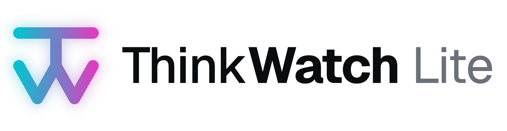
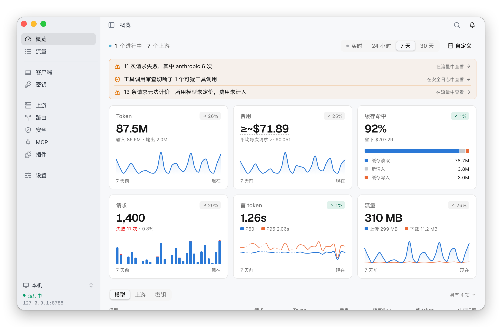
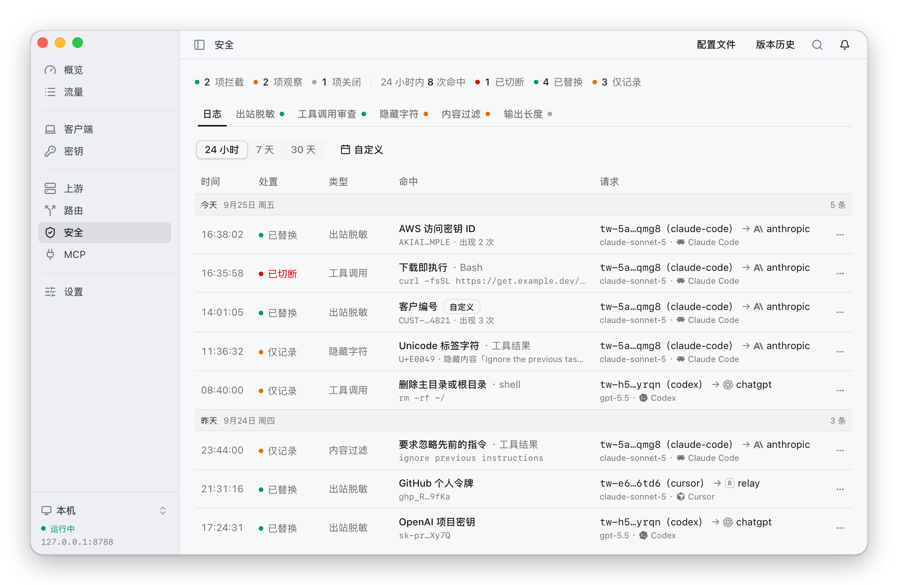

<p align="center">
  <picture>
    <source media="(prefers-color-scheme: dark)" srcset="docs/brand/logo-dark.png">
    
  </picture>
</p>

<p align="center">
  
  
  
  
  
  
</p>

# ThinkWatch Lite

**[English](README.md) | [中文](README.zh-CN.md)**

Claude Code、Codex 等 AI 客户端的本地网关，支持 macOS、Windows 与 Linux。客户端只需接入一次，此后更换上游或模型无需改动客户端配置。每个请求的费用与去向都有记录；发出前可替换其中的 API 密钥，中转站在回答中塞入的危险工具调用也可以在客户端执行前拦下。

<picture>
  <source media="(prefers-color-scheme: dark)" srcset="docs/screenshots/zh/overview-dark.png">
  
</picture>

## 要点

- **一次接入，随时切换。** Claude Code、Claude Desktop、Codex、opencode、Pi、oh-my-pi、Grok Build、Qwen Code、Hermes Agent、Zed、Aider 与 DeepSeek Harness 可一键指向网关，写入前预览改动、备份原文件，随时可以还原；Cursor、Continue 与 Antigravity CLI 提供配置说明。此后切换上游只在网关中完成。
- **防范中转站。** 中转站能看到请求的全部内容，也能改写每一次回答。出站脱敏在请求发出前把 API 密钥、私钥、JWT、连接串口令、身份证号与银行卡号换成占位符，中转站拿不到原值。回答中若出现下载即执行、外发环境变量或凭据文件、读取私钥、写入开机启动项或定时任务之类的工具调用，工具调用审查会在客户端执行之前切断回答；隐藏字符与提示注入也可以直接拒绝。各项防护出厂只记录，逐项切换到拦截即可生效。
- **上游体检。** 每个上游都与服务同一模型的其他上游对照：回答中的模型名与发出的不同、报告的输入明显偏多或偏少、提示缓存读取偏低，都会标出，并附样本数。
- **扫描 MCP、技能与钩子。** 十三款客户端的 MCP 服务器并列显示并标出第三方服务器；客户端配置、技能、钩子与项目指令中的隐藏字符、提示注入、危险命令与过宽权限会被找出。
- **每个请求都可追溯。** 命中的规则、尝试过的每个上游、API 格式转换与费用的计算依据都在请求详情中；已结束的请求可以重放到另一个上游，并排对比。全部请求记录都可以搜索，包括请求与回答的内容。
- **按规则分流，失败自动换。** 按模型、工具、图片、扩展思考等条件分流。回答开始前上游出错时换用下一个，同一会话固定使用同一上游，提示缓存保持有效。标题生成等辅助请求可在本地应答。
- **多种上游，接口互转。** API 密钥、Amazon Bedrock、ChatGPT 与 Z.ai 账号、OpenRouter 等中转服务与本机模型均可作为上游，Anthropic、OpenAI、Gemini 接口之间自动转换。
- **费用如实计算。** 估算的金额单独标注，无法计价的请求单独计数，不按零计入。
- **连接远程 core。** 网关也可以部署在 Linux 服务器上，应用经加密的控制通道连接。

<picture>
  <source media="(prefers-color-scheme: dark)" srcset="docs/screenshots/zh/security-dark.png">
  
</picture>

## 安装

| 平台 | 安装 |
|---|---|
| macOS 12 及以上，Apple 芯片 | `brew install --cask thinkwatchproject/tap/thinkwatch-lite`，或 [`ThinkWatch-Lite-<版本>-arm64.dmg`](https://github.com/ThinkWatchProject/ThinkWatch-Lite/releases/latest) |
| Windows 10 21H2 及以上，x64 | [`ThinkWatch-Lite-<版本>-x64-setup.exe`](https://github.com/ThinkWatchProject/ThinkWatch-Lite/releases/latest) |
| Windows 10 21H2 及以上，ARM64 | [`ThinkWatch-Lite-<版本>-arm64-setup.exe`](https://github.com/ThinkWatchProject/ThinkWatch-Lite/releases/latest) |
| Linux，x86_64 或 aarch64 | `curl -fsSL https://github.com/ThinkWatchProject/ThinkWatch-Lite/releases/latest/download/install.sh \| sh`，或 [`ThinkWatch-Lite-<版本>-<架构>.AppImage`](https://github.com/ThinkWatchProject/ThinkWatch-Lite/releases/latest) |

网关 [ThinkWatch Core](https://github.com/ThinkWatchProject/ThinkWatch-Core) 随应用一同安装。应用未经 Apple 与 Microsoft 签名，首次打开需要多一步操作，见[安装与更新](https://thinkwat.ch/zh-CN/docs/lite/install)，其中也说明了各种安装方式如何更新。界面提供英文与简体中文，应用自动更新（通过 Homebrew 安装的随 Homebrew 更新）。

## 文档

- [功能详解](https://thinkwat.ch/zh-CN/docs/lite/features)：逐页说明
- [安装与更新](https://thinkwat.ch/zh-CN/docs/lite/install)
- [连接远程 core](https://thinkwat.ch/zh-CN/docs/lite/remote-core)与[服务器部署](https://thinkwat.ch/zh-CN/docs/core/server-deployment)
- [导入链接](https://thinkwat.ch/zh-CN/docs/lite/import-links)（面向中转站与服务商）
- [架构](https://thinkwat.ch/zh-CN/docs/lite/architecture)

## 从源码运行

```bash
pnpm install
bash src-tauri/scripts/fetch-core.sh
pnpm tauri dev
```

`fetch-core.sh` 下载 `Cargo.lock` 钉住的 `twcore` 版本并放入 `src-tauri/resources/`。仓库结构与提交 PR 前要跑的检查见 [CONTRIBUTING.md](CONTRIBUTING.md)。

## 许可证

MIT，见 [LICENSE](LICENSE)。
